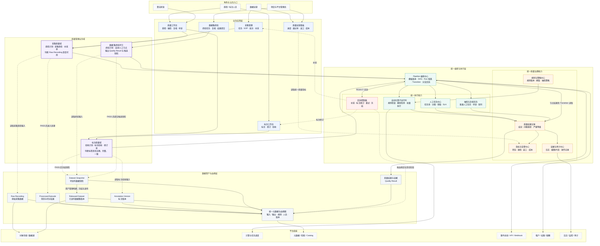
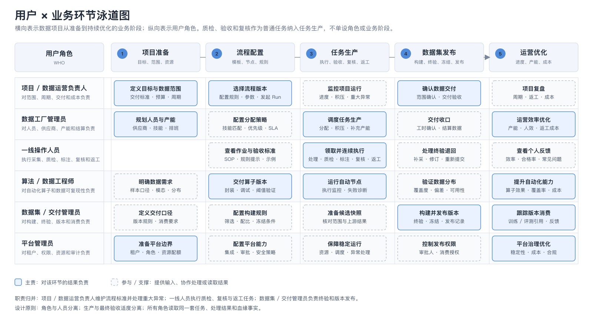
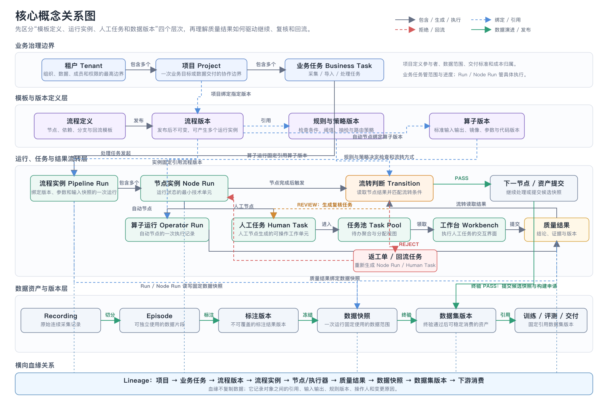

# Quanta 数据处理与质量管理架构方案

> 本方案聚焦数据 Pipeline 的数据处理与质量管理，目标是把“采集质检、标注验收、数据集终验”统一为可配置、可追溯、可回流的质量闭环。

## 一、方案范围与整体架构

### 1.1 产品范围

Quanta 数据平台由三类能力组成：

1. **数据 Pipeline**：采集任务下发、数据采集、标准化处理、切分、质检、标注与验收；终验通过后向数据资产管理提交候选快照、质量结果及构建 / 发布申请。
2. **数据工厂经营管理**：供应商与人员管理、培训考核、产能激励、结算，以及任务、进度、质量、产能和成本分析。
3. **数据资产管理**：多源数据接入、标准化存储、统一组织、检索预览、数据集构建、Dataset Version 冻结与发布、血缘追踪和训练/评测消费。

本期重点讨论 **数据 Pipeline 中的数据处理与质量管理**。工厂经营管理和数据资产管理作为上下游关联能力，不在本期展开。

### 1.2 数据质量管理系统架构

### 1.3 架构关系说明

这张图表达的是系统职责和依赖关系，而不是单纯的数据先后流转：

- **业务应用层**负责不同角色的操作入口；采集、质检、标注和发布仍保持各自的业务工作台。
- **三个质检与验收环节**分别处理采集质检、标注验收和数据集终验，但不各自重复建设规则、任务系统和结果模型。
- **Pipeline 编排中心**决定“何时执行质检、验收或终验节点”；节点产生质量结果，流转条件决定继续、转人工复核还是打回。
- **自动质检、人工质检、抽检和申诉**属于统一执行能力，可以被三类质量业务域按策略复用。
- **质量结果记录**是统一事实源。工作台、看板、终验和数据集发布读取同一份质量结论，避免多个流程分别维护状态。
- **数据资产与血缘层**连接原始数据、处理结果、标注版本、候选快照和发布版本；数据资产管理负责构建、冻结并发布 Dataset Version，终验失败时通过血缘定位到采集或标注责任阶段。
- **平台底座**统一提供存储、计算、元数据、事件、权限和审计能力，上层质量模块不直接重复建设基础设施。

### 1.4 三类质检的职责边界

| 质量环节 | 核心判断 | 主要输入 | 通过后流向 | 不通过后流向 |
|---|---|---|---|---|
| 采集质检 | 原始数据是否满足可用性和采集 SOP | Recording、设备状态、采集上下文 | 切分与清洗 | 补采或重采 |
| 标注验收 | 标签是否正确、完整且一致 | Episode、标注结果、标注规则 | 数据集构建 | 退回标注修订 |
| 数据集终验 | 整个数据批次是否达到交付标准 | 数据快照、质量结果、分布统计、版本信息 | 向数据资产管理提交候选快照和构建 / 发布申请 | 回溯采集、处理或标注责任节点 |

需要明确：

- **采集质检、标注验收和数据集终验是三个普通业务环节；自动质检和人工质检是它们共享的执行方式。**
- 同一质检或验收环节可根据风险、抽检比例和项目要求配置自动节点、人工节点及后续流转。
- **抽检、复核和申诉通过节点与流转条件组合实现，不应被设计成重复的数据处理主流程。**
- 每次质量判断都必须绑定输入数据版本、规则/算子版本、操作人、结论和回流原因，形成完整审计链路。

## 二、现状与核心问题

| 问题 | 现状表现 | 业务影响 |
|---|---|---|
| 流程互相干扰 | 实验与正式流程、预训练与后训练流程共用节点和数据 | 运行稳定性差，问题定位困难 |
| 数据边界不清 | 学习数据、实验数据重复导入；Recording 与视频映射缺少稳定唯一标识 | 数据易混用，重复处理，结果不可复现 |
| 质量职责分散 | 采集质检、标注验收、终验概念混用；自动与人工流程各自维护状态 | 同一问题重复判断，异常回流路径不清 |
| 流程调整成本高 | 节点编排、规则阈值和流转条件依赖研发改动 | 迭代周期长，业务无法自主配置 |
| 缺少版本与审计 | 处理结果未完整关联输入快照、规则版本和操作记录 | 无法准确回答“数据为何通过、由谁处理、从哪一版产生” |

## 三、用户分析

### 3.1 用户 × 业务环节泳道图

读图规则：

- 横向表示从项目准备、流程配置、任务生产到数据集发布和运营优化的完整业务链路；质检、验收和复核作为普通任务纳入任务生产。
- 纵向表示参与业务的六类用户角色；**蓝色实线卡片**表示该角色对当前环节负主要责任，**灰色虚线卡片**表示参与、协同或提供支持。
- 每个环节都有明确的业务负责人，但流程、任务、质量结果和数据版本由平台对象贯通，避免依靠线下交接维护状态。
- 项目 / 数据运营负责人维护交付标准、流程规则并处理重大异常；一线操作人员执行质检、复核和返工任务；数据集 / 交付管理员负责终验和版本发布；平台管理员提供横向权限、配额、集成和审计能力。

### 3.2 用户角色与需求

平台用户不是简单的“管理员、操作员、算法”三类，而是围绕项目交付、任务生产、数据资产和平台治理形成六类协作角色。

| 用户角色 | 核心目标 | 关键任务 | 主要功能依赖 |
|---|---|---|---|
| 项目 / 数据运营负责人 | 按范围、周期和成本完成数据交付 | 定义项目目标和数据范围；选择流程版本；配置交付标准、处理规则和抽检比例；发起并监控流程实例；处理重大异常 | 项目管理、Pipeline 配置与运行、规则配置、数据范围、异常处理、交付验收 |
| 数据工厂管理员 | 保证人员、供应商和产能能够承接项目计划 | 管理组织与人员；维护技能标签；规划产能；分配任务；跟踪 SLA、返工和结算 | 组织与成员、技能管理、任务池、分配策略、产能看板、成本与结算数据 |
| 采集 / 质检 / 标注操作人员 | 低学习成本、连续地完成被分配任务 | 领取任务；查看数据与 SOP；执行采集、质检、切分、标注或复核；提交结论和证据；处理返工 | 个人任务池、流式工作台、多模态预览、规则提示、快捷操作、个人进度反馈 |
| 算法 / 数据工程师 | 提升自动化覆盖率，并获得可信、可复现的数据 | 开发和验证自动化算子；调试规则阈值；查看误判样本；查询和构建数据集；追踪数据来源 | 算子管理、调试运行、规则版本、数据检索、质量结果、数据快照、版本与血缘 |
| 数据集 / 交付管理员 | 将处理结果沉淀为可安全消费的数据资产 | 筛选和配比数据；冻结快照；执行终验；发布数据集版本；管理下游训练/评测引用 | 数据集构建、数据快照、数据集终验、版本管理、血缘追踪、发布审批、消费记录 |
| 平台管理员 | 保证多项目、多团队使用时安全、稳定、可治理 | 管理租户、角色和权限；配置资源与配额；维护集成；审计高风险操作；处理平台异常 | 租户与权限、资源配额、API / Webhook、日志监控、审计、安全策略 |

### 3.3 用户协作与权限边界

- **角色不等于人员。** 同一人员可在不同项目中承担不同角色，权限应按“租户 + 项目 + 角色”计算，而不是只绑定全局账号。
- **配置者与执行者分离。** 项目 / 数据运营负责人配置流程、规则及抽检比例；一线操作人员只执行被授权任务，不能直接修改生效标准。
- **生产与验收适度分离。** 标注提交者原则上不能完成同一批数据的最终验收；申诉改判和数据集发布应保留独立审批记录。
- **业务配置与算法实现分离。** 算法工程师负责算子能力和版本交付，业务用户负责选择算子、配置阈值和组合流程，不要求业务用户修改代码。
- **不同角色看到同一事实的不同视图。** 操作人员关注“下一条任务”，项目负责人关注进度和风险，算法工程师关注误判样本，管理者关注质量、产能和成本；这些视图必须来自同一套任务、质量结果和血缘数据。

### 3.4 对产品设计的直接要求

1. 平台需要同时提供 **配置入口、生产工作台和运营看板**，不能只做一个流程编排页面。
2. 人工任务必须支持任务池、技能匹配、优先级、SLA、批量领取和连续作业。
3. 自动结果必须可被人工查看、复核和改判，并保留自动结论与人工结论的完整差异。
4. 高风险操作需要按项目配置复核和审批，例如规则发布、批次终验、数据集发布和申诉改判。
5. 项目、流程实例、任务、质量结果和数据版本应使用同一套权限与审计链路。

## 四、核心概念

### 4.1 核心概念关系图

这张图先区分概念所处的层次，再说明对象之间的包含、生成、执行、绑定、回流和数据演进关系：

- **租户包含项目**；项目定义参与者、数据范围、交付标准和成本归属，并绑定明确的流程版本。
- **流程定义发布为不可变的流程版本**；规则与策略版本、算子版本被流程版本引用，保证已发起实例可以复现。
- **项目基于流程版本发起流程实例**；一个流程实例包含多个节点实例，节点可实例化为算子运行、人工任务或逻辑流转。
- **人工任务进入任务池，并由操作人员在工作台领取和提交**；自动节点直接生成算子运行，两条执行分支最终都产生结构化质量结果。
- **质检或验收节点产生质量结果**，Transition 根据 PASS、REVIEW 或 REJECT 路由；REVIEW 生成复核任务，REJECT 生成返工单并回到责任节点，而不是覆盖原执行记录。
- **流程实例和节点实例读写明确的数据快照**；终验通过后，Pipeline 将候选快照、质量结果和血缘提交给数据资产管理，由数据资产管理构建并发布不可变的数据集版本。
- **血缘关系横向连接项目、流程版本、运行实例、执行记录、质量结果和数据版本**，用于回答“哪一版流程处理了哪批数据、采用哪版规则、由谁判定、为何发布或返工”。

### 4.2 业务与流程概念

| 概念 | 定义 | 关键边界与关系 |
|---|---|---|
| 租户 Tenant | 一个组织或客户在平台中的最高级资源与权限边界 | 租户之间的数据、成员、角色、配额和配置默认隔离 |
| 项目 Project | 围绕一次业务目标或数据交付建立的协作与治理边界 | 项目定义参与人员、数据范围、交付标准和成本归属；项目不是流程，也不是数据集 |
| 流程定义 Pipeline Definition | 可复用的处理逻辑模板，由节点及其依赖、分支和回流关系组成 | 描述“应该怎样处理”，不包含某次运行的具体数据和状态 |
| 流程版本 Pipeline Version | 流程定义发布后的不可变版本 | 节点、参数、规则绑定或分支发生变化时发布新版本；已运行实例不得被新版本追溯修改 |
| 流程实例 Pipeline Run | 项目基于某一流程版本发起的一次独立运行 | 固定流程版本、输入数据快照和运行参数；同一流程版本可以产生多个相互隔离的实例 |
| 流程节点 Node | 流程中的一个能力位置，定义输入、输出、执行器和流转条件 | 节点是模板级定义，可以配置为自动节点、人工节点或逻辑节点 |
| 节点实例 Node Run | 某个流程实例中，一个节点的一次实际执行 | 记录输入快照、执行器版本、状态、输出、日志、重试和异常；它是运行状态的最小技术单元 |

### 4.3 执行与质量概念

| 概念 | 定义 | 关键边界与关系 |
|---|---|---|
| 算子 Operator | 可被自动节点调用的标准化处理能力 | 算子不等于脚本文件；脚本只有封装为稳定输入输出、运行环境、参数和版本后，才成为可编排算子 |
| 算子运行 Operator Run | 算子在某个节点实例中的一次自动执行 | 记录算子版本、参数、资源、日志和输出；它不是人工任务，也不进入人工任务池 |
| 人工任务 Human Task | 人工节点为一个人或一个小组生成的可操作工作单元 | 任务绑定流程实例、节点实例、数据范围、SOP、优先级和 SLA；“采集任务”等业务单据应在名称上与人工执行任务区分 |
| 任务池 Task Pool | 按项目、任务类型、技能、优先级或组织聚合人工任务的分配视图 | 任务池不拥有业务数据，也不改变流程逻辑；它负责待办聚合、分配、领取和负载均衡 |
| 工作台 Workbench | 执行人工任务的交互界面 | 工作台不是核心业务对象；质检、标注、抽检和终验可复用同一工作台框架，但加载不同工具和规则 |
| 流转 Transition | 根据节点结果和条件决定下一节点 | 支持继续、转人工复核、跳过或回流；它不执行质检或验收 |
| 规则 Rule | 对单条或批次数据执行的确定性检查条件 | 例如缺帧率、必填字段和时长范围；规则命中产生检查结果，但不一定直接等于最终质量结论 |
| 策略 Policy | 组合规则、风险、抽检比例和项目要求形成的节点执行约束 | 被质检或验收节点固定引用，用于生成结构化检查结论；它不直接控制流程分支、人工任务生成或回流位置 |
| 质量结果 Quality Result | 质检、验收或终验节点对特定数据版本产生的结构化判断记录 | 包含检查项、问题类型、严重等级、结论、证据、规则/算子版本和操作人；改判应生成新记录并保留原结论 |

### 4.4 数据与版本概念

| 概念 | 定义 | 关键边界与关系 |
|---|---|---|
| Recording | 一次连续采集产生的原始多模态记录 | 是采集质检的主要对象，可以包含视频、状态、动作和设备上下文 |
| Episode | 从 Recording 中切分出的可独立训练或评测的数据片段 | Episode 与 Recording 是多对一关系；切分规则和版本需要进入血缘 |
| 标注版本 Annotation Version | 针对特定 Episode 形成的一版结构化标注结果 | 修订或改判产生新版本，不能覆盖历史提交；标注验收必须绑定明确版本 |
| 数据快照 Data Snapshot | 某次流程实例或节点实例固定使用的不可变数据范围 | 用于保证运行隔离和结果复现；快照可以是中间结果，不代表已经形成可发布数据集 |
| 数据集版本 Dataset Version | 通过终验并可被训练、评测或交付稳定引用的数据资产版本 | 由数据快照、筛选配比、质量状态和发布记录组成；下游引用必须固定版本 |
| 血缘 Lineage | 描述输入数据、处理节点、算子/规则、人工操作、质量结果和输出版本之间的关系图 | 血缘不复制数据，而是回答“从哪里来、经过什么处理、为何通过、被谁使用” |

### 4.5 容易混淆的概念

| 容易混淆 | 正确区分 |
|---|---|
| 项目 vs. 流程 | 项目回答“为谁、交付什么、由谁负责”；流程回答“数据怎样被处理” |
| 流程 vs. 流程实例 | 流程是可复用模板；流程实例是绑定具体版本、数据和参数的一次运行 |
| 节点实例 vs. 人工任务 | 节点实例是工作流运行记录；只有人工节点才生成可被领取和处理的人工任务 |
| 算子 vs. 脚本 | 脚本是实现文件；算子是被平台标准化封装、可版本化和可运行的能力 |
| 任务池 vs. 流程节点 | 任务池负责人工待办分配；流程节点负责定义处理逻辑和前后依赖 |
| 自动质检 vs. 人工质检 | 二者是质检或验收节点的不同执行方式，不是两套相互独立的 Pipeline |
| 质量结果 vs. 流转 | 质量结果是判断记录；Transition 读取结果并决定继续、复核或打回 |
| 数据快照 vs. 数据集版本 | 快照用于固定一次处理的数据范围；数据集版本是完成终验后可被稳定消费的发布资产 |
| Catalog vs. 数据集 | Catalog 管理数据的位置、Schema、分区和权限；数据集管理面向训练/评测的样本集合及其版本 |

## 五、建设目标与设计原则

| 建设目标 | 设计原则 | 对应能力 |
|---|---|---|
| 多流程并行且相互隔离 | 流程定义、运行实例和数据快照分离 | Pipeline 模板版本、Run 隔离、数据版本 |
| 提升数据流转效率 | 自动节点与人工任务使用统一的输入输出协议 | 任务池、分配机制、流式工作台、批量操作 |
| 缩短流程迭代周期 | 节点、规则、分支和回流路径配置化 | 可视化编排、规则中心、版本发布 |
| 建立统一质量闭环 | 三类质量环节使用一致的结果、复核和打回机制 | 自动校验、人工复核、抽检、申诉、终验 |
| 保证结果可复现、可审计 | 任一输出都能追溯到输入数据、流程、规则和人员 | 数据血缘、操作日志、质量结果版本 |
| 支撑经营与持续优化 | 统一采集进度、质量、产能、返工和成本口径 | 质量看板、产能看板、瓶颈分析 |

## 六、核心方案

### 6.1 自动化算子与人工节点统一编排

所有处理节点使用统一契约：

- **输入**：数据快照、上游质量结果、业务参数。
- **执行器**：自动化算子或人工工作台。
- **输出**：新数据快照、结构化结论和处理证据。
- **状态**：待执行、执行中、待复核、成功、失败、已打回、已取消。
- **控制**：超时、重试、抽检、转人工、跳过、回流。
- **审计**：执行器版本、规则版本、操作人、时间和变更原因。

算法团队负责自动化算子的开发和交付；业务团队通过配置完成常规流程编排、规则选择和阈值调整。

### 6.2 数据隔离、幂等与血缘

- 每次 Pipeline Run 固定输入数据范围，生成独立的数据快照，避免实验数据和正式数据相互污染。
- 为 Recording、Episode 和 Dataset Version 建立稳定唯一标识。
- 节点按“输入快照 + 节点版本 + 参数”生成幂等键，避免重复导入和重复计算。
- 所有输出记录上游输入、处理节点、规则/算子版本和人工操作，支持从数据集回溯至原始采集数据。

### 6.3 质量治理

- 统一问题类型、严重等级、通过/不通过/待复核结论和回流原因。
- 抽检策略支持固定比例、风险采样、最小样本量和项目级覆盖。
- 申诉复核只改变质量结论，不复制原始数据；改判必须保留前后结论和理由。
- 数据集发布前执行终验，未通过的数据版本不得被训练、评测或交付任务引用。

## 七、分阶段建设建议

### Phase 1：打通核心闭环

- 支持采集质检、切分、标注、标注验收、数据集构建和终验。
- 实现 Pipeline 模板版本、Run 隔离、数据快照和基础血缘。
- 统一自动算子与人工任务的输入输出、状态和质量结论。
- 上线基础任务池、工作台、回流处理和质量看板。

### Phase 2：提升规模化运营能力

- 增加规则中心、抽检策略、申诉复核和批量处理。
- 增加任务分配、人员技能、SLA、产能、返工和成本分析。
- 支持多供应商、多项目和多数据类型下的权限与数据隔离。

### Phase 3：提升自动化与智能化水平

- 建立可复用的算子库和组合式 Pipeline 模板。
- 引入风险评分、智能抽检、质量异常聚类和瓶颈预测。
- 基于历史质量结果持续优化规则阈值、自动化覆盖率和任务分配策略。

## 八、建议验收指标

| 方向 | 建议指标 |
|---|---|
| 稳定性 | 并行 Pipeline 之间的数据串扰和状态串扰为 0 |
| 可追溯性 | 发布数据对输入快照、流程版本、规则版本和操作记录的血缘覆盖率 |
| 流转效率 | 各质检与验收环节的待处理时长、返工周期、端到端交付周期 |
| 自动化 | 自动通过率、转人工率、自动结论与人工复核一致率 |
| 质量 | 各质检与验收环节通过率、问题漏检率、返工率、终验退回率 |
| 迭代效率 | 常规节点组合、规则或阈值调整无需研发发版的占比 |
