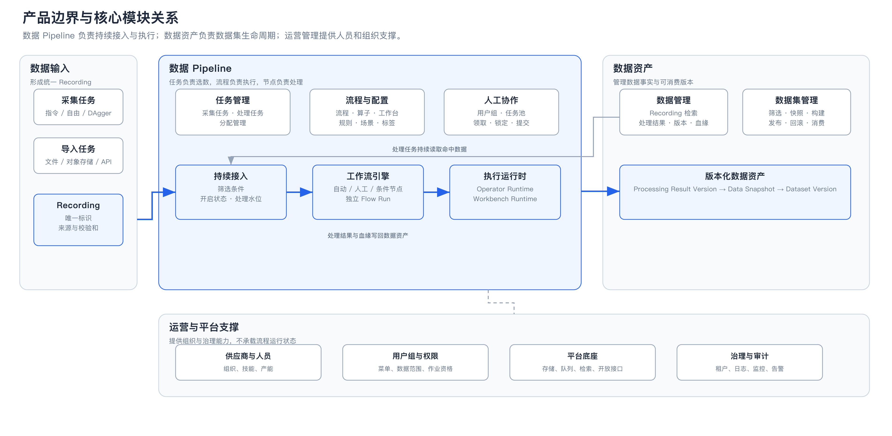
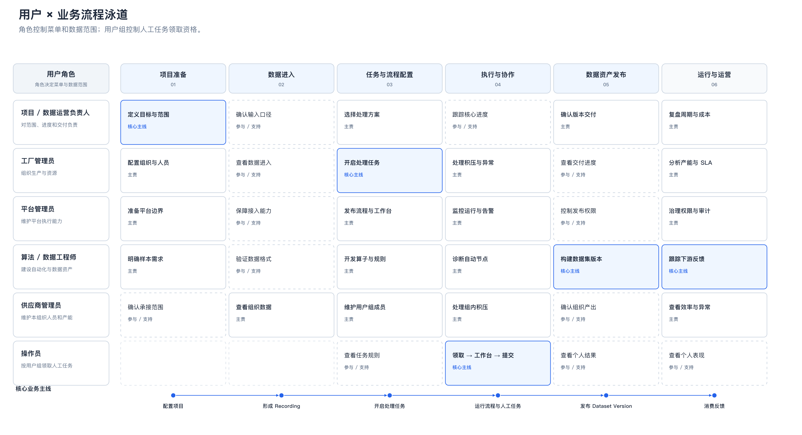
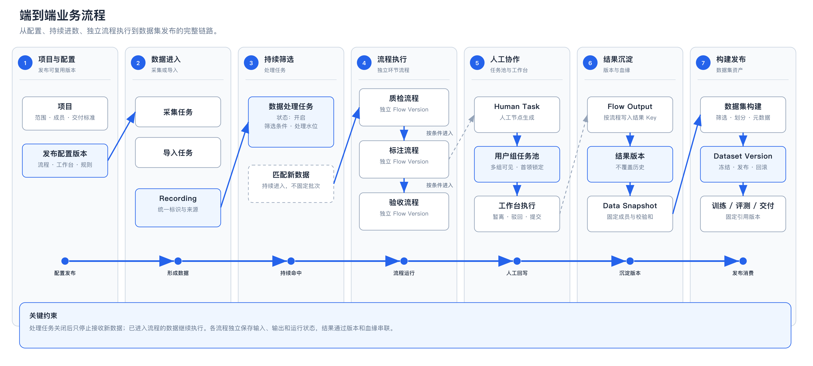
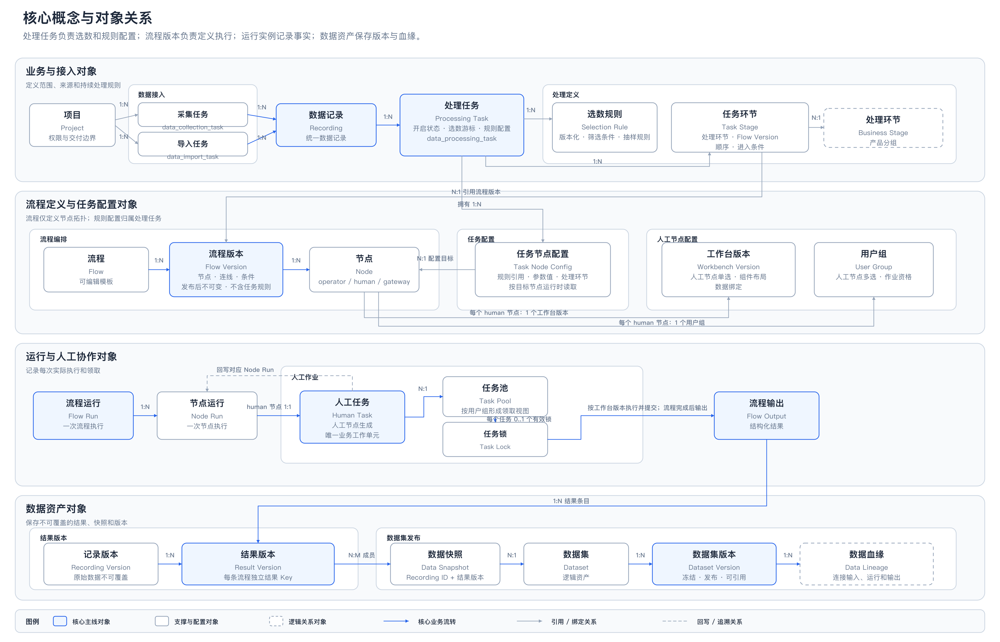
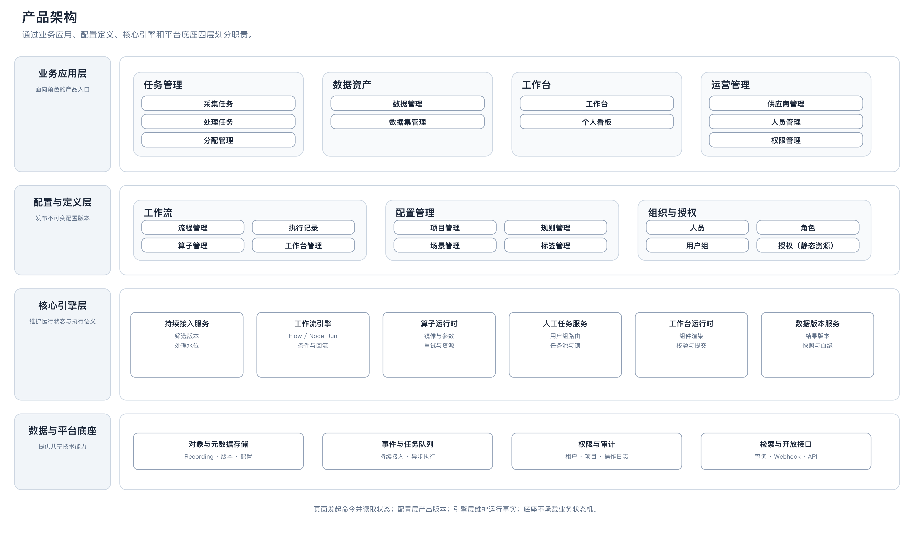
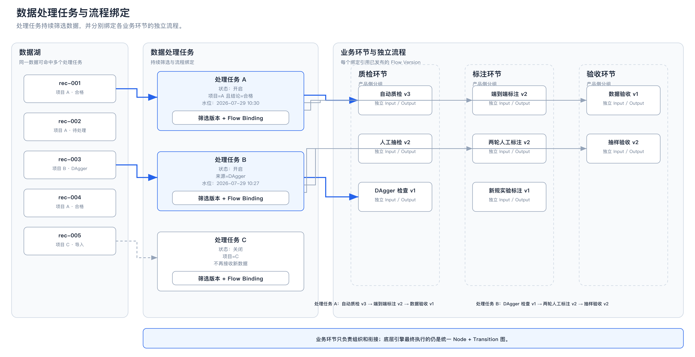
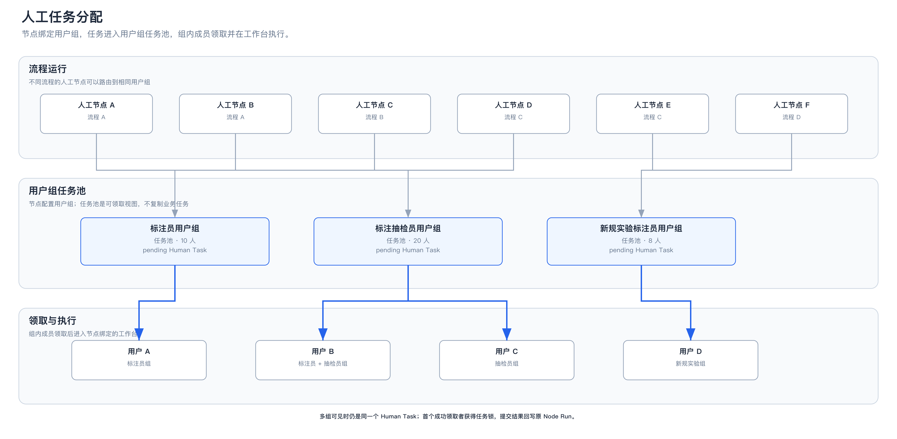
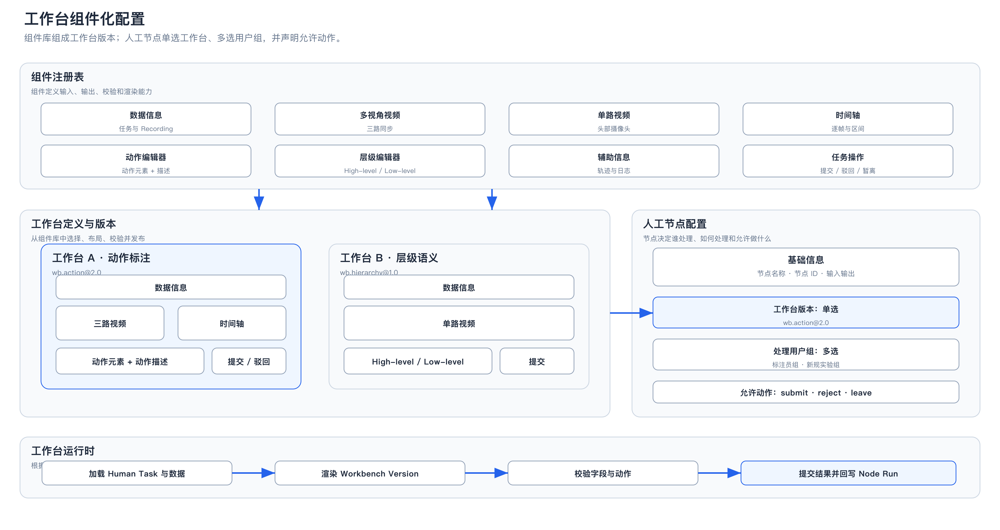
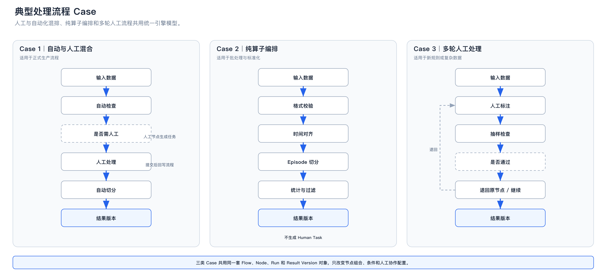
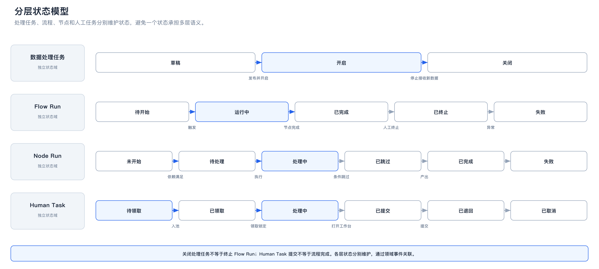

# Quanta 数据平台产品方案（流程任务模型重构版）

> 本方案聚焦数据采集、导入、处理和数据集发布链路。核心调整是：处理任务负责持续选数，流程负责定义执行，人工节点通过用户组任务池分配，工作台通过组件组合形成。

## 目录

- [1. 文档概述](#1-文档概述)
- [2. 产品边界与总体方案](#2-产品边界与总体方案)
- [3. 用户组织与权限](#3-用户组织与权限)
- [4. 端到端业务流程](#4-端到端业务流程)
- [5. 核心概念与对象模型](#5-核心概念与对象模型)
- [6. 产品架构与功能模块](#6-产品架构与功能模块)
- [7. 核心功能设计](#7-核心功能设计)
- [8. 典型业务 Case](#8-典型业务-case)
- [9. 领域规则与技术约束](#9-领域规则与技术约束)
- [10. 一期范围与验收标准](#10-一期范围与验收标准)

## 1. 文档概述

### 1.1 调整背景

当前产品需要同时支持两类任务：

- **纯自动任务**：由算子和条件节点完成数据转换、检查、切分和统计。
- **人工协同任务**：流程运行到人工节点后生成任务，由符合资格的人员领取并在工作台完成。

原方案将一个处理任务绑定为一条完整 Pipeline，难以表达持续进数、流程复用、独立环节运行和节点级用户组分配。本方案重新划分任务、流程、运行对象和工作台的职责。

### 1.2 建设目标

1. 处理任务开启后，符合条件的新数据自动进入处理。
2. 质检、标注、验收等业务环节分别绑定独立流程，流程可以复用。
3. 自动节点和人工节点由同一工作流引擎编排。
4. 人工任务按用户组进入任务池，不在流程中绑定具体人员。
5. 工作台由可复用组件组成，并以版本方式绑定到人工节点。
6. 原始数据、处理结果、快照和数据集版本均可追溯。

### 1.3 核心方案结论

| 主题 | 方案结论 |
|---|---|
| 处理任务 | 持续生效的选数与任务环节配置对象，不等于一次流程运行 |
| 处理环节 | 产品侧的流程分类，不是工作流引擎元素 |
| 流程 | 独立发布的节点图，每条流程拥有自己的输入、输出和运行状态 |
| 人工分配 | 人工节点绑定用户组，Human Task 进入用户组任务池 |
| 工作台 | 组件化、可版本化；人工节点单选工作台版本 |
| 数据资产 | 负责结果版本、数据快照、数据集构建、发布和消费 |

## 2. 产品边界与总体方案

### 2.1 产品边界



各模块职责如下：

- **数据输入**：通过采集任务或导入任务形成统一 `recording`。
- **数据 Pipeline**：完成持续选数、流程执行、人工协同和结果回写。
- **数据资产**：管理数据检索、处理结果、快照、数据集版本和血缘。
- **运营与平台支撑**：提供供应商、人员、用户组、权限、存储、队列、监控和审计能力。

数据集构建与发布属于数据资产模块。数据 Pipeline 只提交处理结果和候选数据范围。

### 2.2 处理流程方案选择

| 方案 | 产品表达 | 优点 | 取舍 |
|---|---|---|---|
| 方案一：按业务环节组织独立流程 | 一个处理任务分别绑定质检、标注、验收等流程 | 业务清晰，流程容易复用和独立迭代 | 需要定义流程间的输入输出和衔接条件 |
| 方案二：单一端到端节点图 | 所有节点编排在一条完整流程中 | 引擎模型直接，跨环节编排自由 | 流程过大，业务维护和复用成本高 |

一期采用方案一。底层引擎仍统一执行 `Node + Transition`，后续可以在不更换引擎的情况下支持方案二。

### 2.3 模块协作关系

```text
处理任务：决定哪些数据进入处理
处理流程：决定数据如何执行
流程节点：决定具体处理能力
用户组任务池：决定人工任务由谁领取
工作台：决定人工节点如何交互
数据资产：决定结果如何保存、构建和发布
```

## 3. 用户组织与权限

### 3.1 用户角色

角色控制菜单权限和数据范围，不直接决定人工任务分配。

| 用户角色 | 主要职责 | 主要范围 |
|---|---|---|
| 项目 / 数据运营负责人 | 定义项目目标、数据范围和交付标准，选择处理方案并确认版本交付 | 授权项目 |
| 工厂管理员 | 维护组织、人员和产能，开启处理任务，处理积压和资源异常 | 项目及运营范围 |
| 平台管理员 | 发布流程、算子和工作台，维护平台能力并监控运行 | 平台配置与运行记录 |
| 算法 / 数据工程师 | 开发自动化算子和规则，分析运行结果，构建数据集版本 | 授权数据及公共配置 |
| 供应商管理员 | 维护本组织成员、用户组和产能，处理组织内任务积压 | 所属组织 |
| 操作员 | 根据所属用户组领取人工任务，在工作台执行并提交 | 个人任务与结果 |

### 3.2 角色、用户组与任务池

| 概念 | 解决的问题 | 主要配置 |
|---|---|---|
| 角色 | 用户可以访问哪些菜单和数据 | 菜单权限、数据范围、资源动作 |
| 用户组 | 用户具备哪些人工任务的作业资格 | 成员、组织、技能、有效状态 |
| 任务池 | 当前有哪些可领取的人工任务 | 用户组、优先级、SLA、领取状态 |

一个用户可以拥有多个角色，也可以加入多个用户组。角色和用户组分别计算，不互相替代。

### 3.3 用户 × 业务流程泳道



蓝色实线卡片表示该角色对当前阶段结果主责，虚线卡片表示参与或支持。图下方的主线用于快速识别核心业务链路。

## 4. 端到端业务流程

### 4.1 业务主流程



主流程为：

1. 发布项目需要的流程、工作台和规则版本。
2. 数据通过采集或导入进入数据湖，形成 `recording`。
3. 开启的处理任务持续筛选新数据。
4. 数据按绑定关系进入不同业务环节的流程。
5. 自动节点由算子运行时执行；人工节点进入用户组任务池。
6. 各流程将结构化结果写入独立结果版本。
7. 数据资产模块生成快照、构建并发布数据集版本。

### 4.2 持续进数

处理任务不是一次性批次。任务开启后，系统按照选数规则和处理游标持续匹配新数据。

常用筛选字段包括：

- 项目、来源类型、来源任务 ID。
- 采集人、设备、场景和数据时间。
- 质检结论、标注状态和已有处理流程。
- 数据标签、版本及自定义元数据。

关闭处理任务后，不再接收新数据；已经进入流程的数据继续执行。

### 4.3 环节流程衔接

质检、标注、验收是产品侧的流程分组，不是独立产品模块。每个环节绑定一条已发布流程，并配置：

- 流程版本。
- 执行顺序。
- 进入条件。
- 输入字段映射。
- 输出结果 Key。
- 失败或终止处理方式。

上一流程完成后，处理任务根据输出结果决定是否进入下一任务环节。

### 4.4 数据集构建与发布

流程完成后形成候选处理结果。数据资产模块负责：

1. 按项目、标签、处理结果等条件筛选数据。
2. 固定成员清单和校验和，生成 `data_snapshot`。
3. 配置 train / val / eval 划分和版本元数据。
4. 构建、冻结并发布 `dataset_version`。
5. 记录训练、评测和交付对版本的引用。

## 5. 核心概念与对象模型

### 5.1 核心概念关系



### 5.2 核心对象

以下名称为产品展示名；已有 Entity Key 保持稳定，避免影响代码和存量数据。

| 层级 | 核心概念 | Entity Key | 定义 | 关键关系 |
|---|---|---|---|---|
| 业务与接入 | 项目 | `project` | 数据生产与交付的管理边界，组织任务、人员、权限和数据范围。 | 一个项目包含多个采集任务和导入任务。 |
| 业务与接入 | 采集任务 | `data_collection_task` | 通过设备或采集系统产生数据的任务，定义采集目标、方式和执行要求。 | 归属一个项目；一个采集任务产生多条数据记录。 |
| 业务与接入 | 导入任务 | `data_import_task` | 将已有数据批量接入平台的任务，管理来源、格式、去重和导入结果。 | 归属一个项目；一个导入任务产生多条数据记录。 |
| 业务与接入 | 数据记录 | `recording` | 平台统一管理的单条原始数据对象，是后续处理和资产构建的基础。 | 来源于一个采集任务或导入任务；一条记录可进入多个处理任务。 |
| 业务与接入 | 处理任务 | `data_processing_task` | 持续选取数据并驱动处理流程运行的业务任务，维护开启状态和处理游标。 | 拥有多个选数规则、任务环节和任务节点配置。 |
| 业务与接入 | 选数规则 | `processing_task_filter_version` | 处理任务使用的版本化选数配置，固定筛选条件、抽样方式和生效范围。 | 归属一个处理任务；同一任务可保留多个历史版本。 |
| 业务与接入 | 任务环节 | `stage_flow_binding` | 处理任务中的有序环节对象，指定处理环节、流程版本、顺序和进入条件。 | 归属一个处理任务；引用一个处理环节和一个流程版本。 |
| 业务与接入 | 处理环节 | `business_stage` | 对处理过程的标准业务分类，如清洗、标注、验收和后处理。 | 可被多个任务环节引用；本身不定义具体执行步骤。 |
| 流程与配置 | 流程 | `flow_definition` | 可编辑的流程逻辑对象，用于维护节点拓扑，不保存运行事实。 | 一个流程可发布多个流程版本。 |
| 流程与配置 | 流程版本 | `flow_version` | 流程发布后的不可变版本，固定节点、连线和分支条件。 | 归属一个流程；包含多个节点；可被多个任务环节复用。 |
| 流程与配置 | 节点 | `node` | 流程中的最小执行位置，分为自动化节点、人工节点和网关节点。 | 归属一个流程版本；运行时生成节点运行。 |
| 流程与配置 | 任务节点配置 | `processing_task_rule_config` | 处理任务针对目标节点设置的规则引用和参数值。 | 归属一个处理任务并指向一个节点；不写入流程版本。 |
| 流程与配置 | 工作台版本 | `workbench_version` | 人工节点使用的不可变界面版本，固定组件布局、数据绑定和校验方式。 | 每个人工节点绑定一个工作台版本；同一版本可被多个节点复用。 |
| 流程与配置 | 用户组 | `user_group` | 具备相同人工任务作业资格的人员集合。 | 每个人工节点绑定一个用户组；同一用户组可服务多个节点。 |
| 运行与协作 | 流程运行 | `flow_run` | 流程版本的一次实际执行，记录状态、上下文和最终输出。 | 关联一个处理任务和流程版本；包含多个节点运行。 |
| 运行与协作 | 节点运行 | `node_run` | 某个节点在一次流程运行中的实际执行记录。 | 归属一个流程运行；人工节点运行生成一个人工任务。 |
| 运行与协作 | 人工任务 | `human_task` | 人工节点生成的唯一业务工作单元，包含待处理数据和任务状态。 | 对应一个节点运行；进入节点所绑定用户组的任务池。 |
| 运行与协作 | 任务池 | `task_pool` | 按用户组形成的待领取任务视图，不是独立处理流程。 | 一个任务池聚合多个人工任务。 |
| 运行与协作 | 任务锁 | `task_claim` | 人工任务当前的有效占用关系，记录执行人和锁定状态。 | 每个人工任务最多存在一个有效任务锁；获得锁后按节点绑定的工作台版本加载页面。 |
| 运行与协作 | 流程输出 | `flow_output` | 一次流程运行完成后形成的结构化输出。 | 对应一次流程运行，可生成多条结果版本。 |
| 数据资产 | 记录版本 | `recording_revision` | 数据记录的不可变修订版本，修改时新增版本而不覆盖历史。 | 一条数据记录可包含多个记录版本。 |
| 数据资产 | 结果版本 | `processing_result_version` | 某条数据经过一次处理流程后形成的不可变结构化结果。 | 关联记录版本、处理任务和流程运行；可被多个数据快照引用。 |
| 数据资产 | 数据快照 | `data_snapshot` | 某一时点冻结的成员清单，成员由数据记录 ID 和结果版本共同确定。 | 包含多条结果成员；不复制原始数据；为数据集版本提供固定内容。 |
| 数据资产 | 数据集 | `dataset` | 具有明确业务用途、可持续演进的逻辑数据资产。 | 一个数据集可发布多个数据集版本。 |
| 数据资产 | 数据集版本 | `dataset_version` | 数据集冻结并发布后的不可变版本，可被训练、评测和交付稳定引用。 | 归属一个数据集；绑定一份数据快照。 |
| 数据资产 | 数据血缘 | `lineage_edge` | 输入、处理任务、流程运行、结果版本和数据集版本之间的来源与产出关系。 | 一个对象可拥有多条输入或输出血缘。 |

### 5.3 关键对象关系

- 一个项目包含多个采集任务和导入任务。
- 一个采集任务或导入任务可以产生多条数据记录。
- 一条数据记录可以进入多个处理任务。
- 一个处理任务拥有多个选数规则、任务环节和任务节点配置。
- 一个任务环节引用一个处理环节和一个流程版本；同一流程版本可被多个任务环节复用。
- 一个流程包含多个流程版本，一个流程版本包含多个节点。
- 任务节点配置归属处理任务并指向目标节点，不属于流程版本。
- 每个人工节点绑定一个工作台版本和一个用户组；工作台版本和用户组均可被多个节点复用。
- 一个流程运行包含多个节点运行；只有人工节点运行才生成一条人工任务。
- 多个人工任务进入同一用户组的任务池；每个人工任务最多存在一个有效任务锁。
- 获得任务锁后，平台按节点绑定的工作台版本加载页面；提交结果写回节点运行，流程继续执行。
- 记录版本和结果版本均不可覆盖；结果版本通过数据快照进入数据集版本。

### 5.4 版本与血缘

以下对象发布后不可原地修改：

- `flow_version`
- `workbench_version`
- `processing_task_filter_version`
- `recording_revision`
- `processing_result_version`
- `data_snapshot`
- `dataset_version`

任何重试、退回、修订或再处理都生成新的运行记录或结果版本，并通过 `lineage_edge` 连接前后关系。

## 6. 产品架构与功能模块

### 6.1 分层产品架构



架构分为四层：

| 架构层 | 职责 |
|---|---|
| 业务应用层 | 面向用户提供任务、数据、工作台和运营入口 |
| 配置与定义层 | 维护并发布流程、算子、工作台、规则和权限配置 |
| 核心引擎层 | 维护持续接入、流程运行、人工任务和数据版本 |
| 数据与平台底座 | 提供存储、队列、检索、权限、审计和开放接口 |

### 6.2 功能模块与菜单

| 模块 | 菜单 | 核心功能 |
|---|---|---|
| 任务管理 | 采集任务 | 创建和管理指令采集、自由采集、DAgger 采集任务 |
| 任务管理 | 处理任务 | 配置选数规则、开启状态、处理游标和任务环节 |
| 任务管理 | 分配管理 | 处理积压、人工改派、缺失绑定和数据再处理 |
| 数据资产 | 数据管理 | 检索 Recording，查看来源、状态、处理结果、版本和血缘 |
| 数据资产 | 数据集管理 | 筛选、快照、划分、构建、发布、回滚和消费管理 |
| 工作台 | 工作台 | 领取并执行当前用户有资格处理的人工任务 |
| 工作台 | 个人看板 | 查看个人待办、完成量、耗时、SLA 和处理表现 |
| 工作流 | 流程管理 | 编辑节点图、校验、试运行和发布 Flow Version |
| 工作流 | 执行记录 | 查看 Flow Run、Node Run、日志、输入输出和异常 |
| 工作流 | 算子管理 | 注册自动化能力，维护镜像、入口、参数和版本 |
| 工作流 | 工作台管理 | 维护组件库，组装、预览、校验和发布工作台版本 |
| 配置管理 | 项目管理 | 维护任务所属项目、负责人和描述 |
| 配置管理 | 规则管理 | 维护节点和流转条件引用的规则 |
| 配置管理 | 场景管理 | 维护可被采集任务复用的场景定义 |
| 配置管理 | 标签管理 | 维护版本化的多级标签体系 |
| 运营管理 | 供应商管理 | 维护供应商范围、协议、人员规模和交付状态 |
| 运营管理 | 人员管理 | 维护人员组织、技能、用户组和可用状态 |
| 运营管理 | 权限管理 | 维护角色、菜单、数据范围和资源动作 |

### 6.3 核心服务边界

| 服务 | 维护的事实 | 不负责 |
|---|---|---|
| 持续接入服务 | 选数规则、处理游标、命中记录 | 节点运行状态 |
| 工作流引擎 | Flow Run、Node Run、Transition | 人员组织与数据集发布 |
| 算子运行时 | 自动节点执行、参数、资源和重试 | 人工任务领取 |
| 人工任务服务 | Human Task、用户组路由、任务锁和 SLA | 工作台页面布局 |
| 工作台运行时 | 组件渲染、字段校验和结果提交 | 流程路由决策 |
| 数据版本服务 | 处理结果、快照、数据集版本和血缘 | 流程节点调度 |

## 7. 核心功能设计

### 7.1 处理任务



处理任务包含以下配置：

| 配置组 | 主要字段 |
|---|---|
| 基本信息 | 名称、项目、负责人、优先级、描述 |
| 运行状态 | 草稿、开启、关闭 |
| 筛选规则 | 数据来源、项目、任务、结论、标签和元数据条件 |
| 处理水位 | 最后扫描时间、最后命中记录、规则版本 |
| 流程绑定 | 业务环节、流程版本、顺序、进入条件和输出 Key |
| 运行指标 | 命中量、待处理量、完成量、失败量和平均耗时 |

关键规则：

1. 多个处理任务可以命中同一数据。
2. 每个处理任务独立维护处理水位和运行记录。
3. 关闭任务只停止接收新数据。
4. 修改筛选条件需生成新的选数规则版本。
5. 已进入流程的数据继续引用命中时的配置版本。

### 7.2 处理流程管理

流程管理负责定义“数据如何执行”。流程包含：

- Input 和 Output。
- 自动节点、人工节点、条件节点。
- 节点输入输出映射。
- 条件、分支、跳过和回流。
- 超时、重试和异常出口。
- 流程负责人和业务环节分类。

节点类型统一为：

| `node_type` | 用途 | 执行器 |
|---|---|---|
| `operator` | 自动转换、检查、切分、统计或标注 | Operator Runtime |
| `human` | 生成需要人工处理的工作单元 | Human Task Runtime |
| `gateway` | 根据表达式进行分支、合流或跳过 | Workflow Engine |

业务环节不作为节点类型。引擎只执行流程版本中的节点和流转。

### 7.3 节点与运行

一次流程运行生成一个 `flow_run`，每个实际执行节点生成一个 `node_run`。

Node Run 记录：

- 输入数据版本和上游结果。
- 节点与执行器版本。
- 标准化参数。
- Attempt、开始时间、结束时间和耗时。
- 输出结果、证据、错误和状态。

节点重试生成新的 Attempt，不覆盖之前的执行记录。

### 7.4 人工任务池与分配



人工节点配置：

- 工作台版本：单选。
- 用户组：单选。
- 允许动作：提交、驳回、暂离等。
- 优先级、SLA 和领取方式。

人工任务进入节点绑定的用户组任务池。组内首个领取成功者获得任务锁，其他成员不再重复领取。

分配管理用于处理正常任务池机制之外的情况：

- 任务积压，需要调整用户组或人员。
- 数据未绑定处理任务，需要补建关系。
- 已有数据需要进入新的处理任务。
- 执行人离岗或任务锁超时，需要释放或改派。

### 7.5 工作台配置与运行



工作台由组件注册表中的能力组成。

| 组件类型 | 示例能力 |
|---|---|
| 数据信息 | 任务 ID、Recording ID、指令和上下文 |
| 视频与时序 | 多视角视频、单路视频、时间轴和逐帧定位 |
| 编辑器 | 动作元素与描述、High-level / Low-level |
| 辅助信息 | 轨迹、日志和历史处理结果 |
| 任务操作 | 提交、驳回、暂离 |

“动作元素与描述”和“High-level / Low-level”是两种可选编辑器。一个工作台按业务需要选择其中一种，不在同一编辑区域重复配置。

人工节点是允许动作的权威来源；工作台负责渲染对应操作组件。发布时需要校验工作台支持的动作是否覆盖节点配置。

工作台运行流程：

```text
加载 Human Task 与数据
→ 渲染节点绑定的 Workbench Version
→ 校验字段与允许动作
→ 提交结构化结果
→ 回写对应 Node Run
```

### 7.6 数据结果与数据资产

每条流程读取完整数据对象，但只写入自己的结果 Key。例如：

```yaml
recording_id: rec-001
results:
  quality@flow-v3:
    conclusion: pass
    version: result-qc-008
  annotation@flow-v2:
    payload_ref: ann-2048
    version: result-ann-006
  acceptance@flow-v1:
    conclusion: accepted
    version: result-acc-003
```

新结果不覆盖历史版本。数据管理页面需要展示：

- 数据来源和当前版本。
- 关联处理任务与流程运行。
- 各流程最新结果和历史结果。
- Data Snapshot 和 Dataset Version 引用。
- 完整血缘和操作记录。

### 7.7 运营与配置管理

运营和配置模块提供生产支撑，不直接修改流程运行状态。

- 供应商管理维护服务范围、协议和交付状态。
- 人员管理维护组织、技能、用户组和可用状态。
- 权限管理维护菜单、数据范围和资源动作。
- 项目、规则、场景和标签以版本或审计记录方式管理。

## 8. 典型业务 Case



### 8.1 自动与人工混合

自动节点先执行格式检查或切分；满足条件时生成人工任务。人工提交结果后，流程继续执行后续自动节点。

适用于正式数据生产、复杂规则检查和人工标注。

### 8.2 纯算子编排

整个流程只包含自动节点和条件节点，不生成 Human Task。

适用于数据标准化、格式转换、Episode 切分、统计和批量过滤。

### 8.3 多轮人工处理

流程可以配置首次处理、抽样检查和退回路径。退回后重新生成 Node Run 和 Human Task，历史结果保留。

具体节点名称和处理用户组由业务配置，不固化为平台角色或一级模块。

### 8.4 数据再处理

已有数据可以进入新的处理任务：

- 原流程可以继续，也可以由管理员明确终止。
- 新处理任务引用自己的选数规则和流程版本。
- 新旧运行、结果和数据版本相互隔离。
- 血缘中记录再处理原因和来源版本。

## 9. 领域规则与技术约束

### 9.1 分层状态模型



| 对象 | 建议状态 |
|---|---|
| 处理任务 | `draft`、`open`、`closed` |
| Flow Run | `pending`、`running`、`completed`、`terminated`、`failed` |
| Node Run | `not_started`、`waiting`、`in_progress`、`skipped`、`completed`、`failed` |
| Human Task | `pending`、`claimed`、`in_progress`、`submitted`、`returned`、`cancelled` |

各对象独立维护状态。关闭处理任务不等于终止 Flow Run；提交 Human Task 也不等于流程完成。

### 9.2 输入输出契约

每条流程版本必须声明：

| 契约 | 内容 |
|---|---|
| Input Schema | 必需字段、可选字段和字段类型 |
| Entry Condition | 数据进入流程的条件 |
| Output Schema | 输出 Key、结构和版本策略 |
| Completion Condition | 流程完成判定 |
| Error Contract | 可重试错误、不可重试错误和终止原因 |

流程间通过结构化结果衔接，不读取上一流程的页面状态或人工任务状态。

### 9.3 幂等与并发

建议使用以下信息计算数据进入流程的幂等键：

```text
idempotency_key = hash(
  recording_revision_id
  + data_processing_task_id
  + processing_task_filter_version_id
  + stage_flow_binding_id
  + flow_version_id
)
```

关键约束：

- 同一幂等键不能重复创建 Flow Run。
- 不同处理任务允许处理同一 Recording Revision。
- Human Task 领取必须使用原子锁。
- 工作台提交需要校验任务锁、版本和当前状态。
- 超时释放任务锁时保留操作日志和草稿。

### 9.4 领域命令与事件

| 领域动作 | Command | 成功事件 |
|---|---|---|
| 发布流程版本 | `publish_flow_version` | `FlowVersionPublished` |
| 开启处理任务 | `open_processing_task` | `ProcessingTaskOpened` |
| 关闭处理任务 | `close_processing_task` | `ProcessingTaskClosed` |
| 数据命中任务 | `match_processing_record` | `ProcessingRecordMatched` |
| 发起流程运行 | `start_flow_run` | `FlowRunStarted` |
| 创建人工任务 | `create_human_task` | `HumanTaskCreated` |
| 领取人工任务 | `claim_human_task` | `HumanTaskClaimed` |
| 提交人工结果 | `submit_human_task` | `HumanTaskSubmitted` |
| 发布工作台版本 | `publish_workbench_version` | `WorkbenchVersionPublished` |
| 生成结果版本 | `create_processing_result_version` | `ProcessingResultVersionCreated` |
| 构建数据集版本 | `build_dataset_version` | `DatasetVersionBuilt` |
| 发布数据集版本 | `publish_dataset_version` | `DatasetVersionPublished` |

## 10. 一期范围与验收标准

### 10.1 一期建设范围

- 三类业务任务：采集任务、导入任务、处理任务。
- 处理任务开启/关闭、选数规则和处理游标。
- 业务环节与独立 Flow Version 绑定。
- Flow Definition、Version、Run 和 Node Run。
- `operator`、`human`、`gateway` 三类节点。
- 用户组、任务池、领取锁、SLA 和人工改派。
- 工作台组件注册、组装、预览、发布和运行。
- Processing Result Version、Data Snapshot、Dataset Version 和基础血缘。
- 项目、角色、数据范围、日志、审计和运行监控。

### 10.2 一期非目标

- 不建设单一端到端大流程的完整产品配置方式。
- 不建设独立的质检或验收一级产品中心。
- 不将具体人工处理岗位固化为系统角色。
- 不建设供应商结算和完整经营 ERP。
- 不建设智能派单、异常聚类和自动产能预测。

### 10.3 验收标准

| 场景 | 验收结果 |
|---|---|
| 持续进数 | 新数据符合条件后自动进入开启的处理任务 |
| 任务关闭 | 不再接收新数据，已进入流程的数据继续执行 |
| 流程复用 | 同一 Flow Version 可被多个处理任务引用 |
| 多任务并行 | 同一数据进入多个处理任务时结果互不覆盖 |
| 自动与人工混排 | 自动节点和人工节点可在同一流程中正确衔接 |
| 用户组领取 | 多组可见但只生成一个 Human Task，首个领取者获得锁 |
| 工作台校验 | 工作台组件、节点输入输出和允许动作发布前完成校验 |
| 结果版本 | 每次提交、退回和再处理都保留历史结果 |
| 数据集发布 | 下游只能固定引用已发布的 Dataset Version |
| 全链路追溯 | 可从 Dataset Version 追溯到数据、流程、节点、人员和结果 |

### 10.4 后续演进

基础对象稳定后，可以继续建设：

- 跨业务环节的端到端节点图。
- 按技能、负载和时效自动选择用户组。
- 智能抽样和异常模式发现。
- 处理任务容量预测和弹性扩容。
- 更丰富的工作台组件和自定义布局。
- 供应商结算、成本分析和完整经营闭环。
