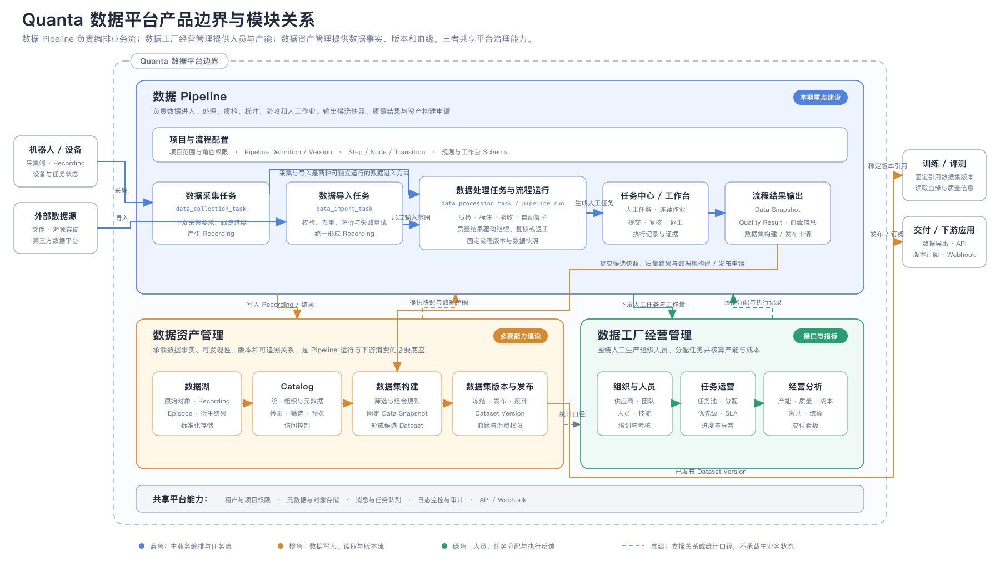
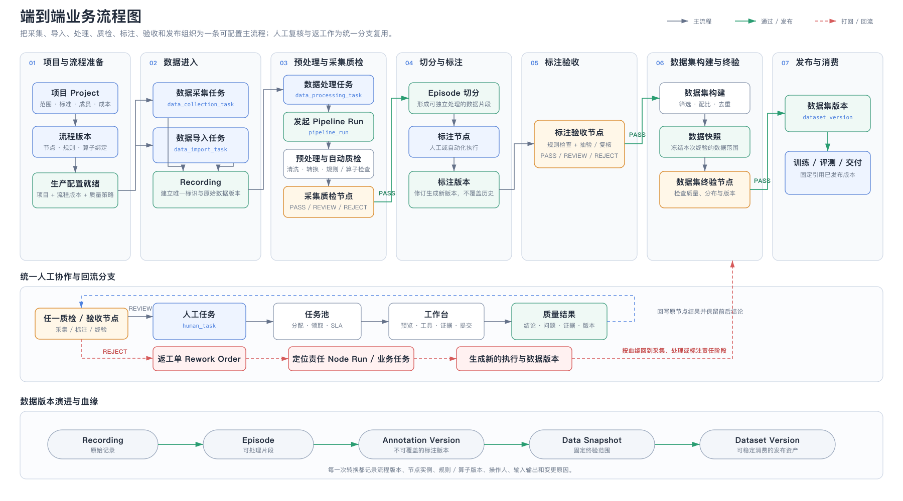
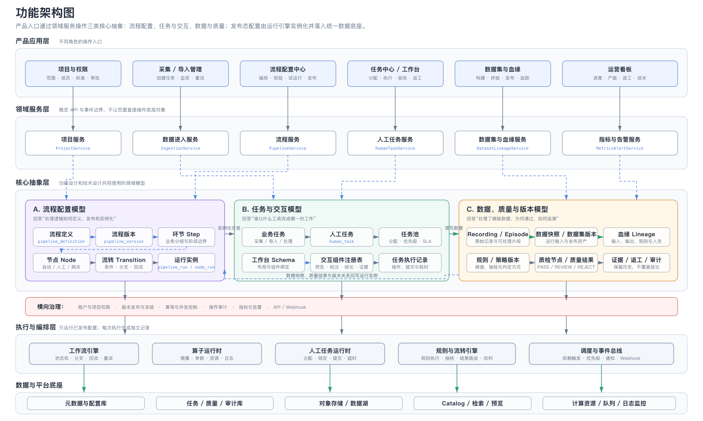

# Quanta 数据平台产品架构调整方案（完善版）

> 本方案聚焦数据 Pipeline，并定义其与数据资产管理、数据工厂经营管理的协作边界，覆盖从数据采集、导入、质检、标注、验收到数据集发布的完整链路。目标是把流程、任务、工作台组件和数据版本抽象为稳定产品对象，使常规流程可由业务配置，研发可直接进入技术设计。

## 一、范围与目标

### 1.1 产品边界



图中三个模块不是彼此独立的系统：

- **数据 Pipeline 是主业务编排层，也是本期重点建设范围**：统一管理数据采集、导入、处理、人工作业、质检、标注和验收，最终输出候选 Data Snapshot、Quality Result、血缘信息及数据集构建 / 发布申请。
- **数据资产管理是 Pipeline 的数据底座，也是数据集生命周期的归属模块**：Pipeline 向其写入 Recording 和处理结果，并从中固定引用 Data Snapshot；数据资产管理负责数据集筛选与构建、Dataset Version 冻结、正式发布、废弃、血缘和消费权限。
- **数据工厂经营管理是人工生产的运营支撑层**：Pipeline 下发 Human Task 和工作量，经营管理模块提供人员、技能、任务分配与产能信息，并把分配和执行记录回传 Pipeline。

本期不建设完整的供应商结算或经营 ERP；只定义其与 Pipeline 之间的任务、人员、产能、质量和成本指标接口。租户权限、元数据、存储、消息、监控和审计作为三个模块共享的平台能力统一建设。

### 1.2 核心问题与建设目标

| 当前问题 | 建设目标 | 核心方案 |
|---|---|---|
| 实验与正式流程、不同训练阶段相互干扰 | 多流程并行、稳定、隔离 | 流程版本、运行实例、数据快照分离 |
| 数据重复导入，Recording 与视频缺少稳定唯一关系 | 数据边界清晰、结果可复现 | 唯一标识、幂等键、输入输出版本与血缘 |
| 流程调整依赖研发修改 | 常规流程由业务配置 | 节点、流转、规则、工作台 Schema 配置化 |
| 自动处理和人工处理各自维护状态 | 统一执行与质量闭环 | Node Run、Human Task、Quality Result 统一协议 |
| 质检、标注验收和终验职责混用 | 各质量环节职责清晰 | 统一 Quality Result、PASS / REVIEW / REJECT 与返工流转 |

## 二、用户分析

### 2.1 用户 × 业务环节泳道图


蓝色实线卡片表示主责，灰色虚线卡片表示协同。角色按“租户 + 项目 + 角色”授权，同一人员可在不同项目承担不同角色。质检、验收和复核均以自动节点或人工任务进入统一任务生产环节，不再单设用户角色或业务模块。

### 2.2 用户及核心诉求

| 用户角色 | 核心诉求 | 主要产品入口 |
|---|---|---|
| 项目 / 数据运营负责人 | 定义交付标准、配置流程规则并按范围、周期和成本完成交付 | 项目、流程配置与运行、异常处理、看板 |
| 数据工厂管理员 | 管理人员、技能、任务分配和产能 | 组织成员、任务池、分配策略、产能 |
| 采集 / 质检 / 标注人员 | 连续执行采集、质检、标注、复核和返工任务 | 个人任务、工作台、返工待办 |
| 算法 / 数据工程师 | 开发算子，分析误判，获取可信数据 | 算子管理、调试、数据检索、血缘 |
| 数据集 / 交付管理员 | 构建数据集、执行终验并发布可消费版本 | 数据集构建、终验、版本与发布 |
| 平台管理员 | 保证多租户使用安全、稳定、可审计 | 权限、配额、集成、日志监控 |

权限设计遵循三个原则：

- 配置者与执行者分离：项目 / 数据运营负责人配置流程和规则，一线操作人员执行任务。
- 生产与最终验收分离：提交者不能直接完成同批数据的最终验收。
- 多角色共用同一事实源：任务、质量结果和数据版本只维护一份事实，不为不同页面复制状态。

## 三、端到端业务流程



业务流程的关键约束：

1. 项目准备并发布流程版本；数据通过采集任务或导入任务进入平台，统一形成具有唯一标识的 `recording`。
2. 数据处理任务绑定流程版本和输入数据范围，生成固定 `pipeline_version_id` 与 `data_snapshot_id` 的 `pipeline_run`。
3. 采集质检、标注验收和数据集终验是三个业务环节；每个环节可以组合自动节点和人工节点。
4. `REVIEW` 生成 `human_task` 并进入任务池；`REJECT` 生成返工单，通过血缘回到责任节点。
5. 返工不覆盖原执行和原数据，而是生成新的 Node Run、任务记录和数据版本。
6. 终验通过后，Pipeline 将候选数据快照、质量结果和血缘信息提交给数据资产管理；由数据资产管理构建并冻结不可变的 Dataset Version，完成正式发布后供训练、评测或交付固定引用。

## 四、核心概念

### 4.1 概念关系图


### 4.2 核心对象与边界

| 概念 | Entity Key | 定义与边界 |
|---|---|---|
| 项目 | `project` | 一次业务目标或数据交付的协作、权限和成本边界，不等于流程或数据集 |
| 业务任务 | `data_collection_task` / `data_import_task` / `data_processing_task` | 管理一批工作的业务范围、负责人、进度和交付状态；不替代运行实例或人工任务 |
| 流程定义 | `pipeline_definition` | 可编辑的处理模板，描述环节、节点、流转和回流关系 |
| 流程版本 | `pipeline_version` | 流程发布后的不可变版本；运行实例必须固定引用 |
| 业务环节 | `step` | 面向业务的流程分组和阶段边界，如采集质检、标注、终验 |
| 流程节点 | `node` | 最小可编排能力位置，定义输入、输出、执行器和流转条件 |
| 流转 | `transition` | 节点间的条件、分支和回流关系 |
| 流程实例 | `pipeline_run` | 某个项目基于某一流程版本发起的一次隔离运行 |
| 节点实例 | `node_run` | 节点在某次流程运行中的一次实际执行记录 |
| 人工任务 | `human_task` | 人工节点生成的可分配工作单元；进入任务池并在工作台执行 |
| 任务池 | `task_pool` | 人工任务的聚合和分配视图，不拥有业务数据，也不定义流程逻辑 |
| 工作台 Schema | `workbench_schema` | 人工节点使用的布局、组件、数据绑定、校验和提交动作定义 |
| 规则 / 策略版本 | `policy_version` | 定义检查条件、抽检方式和流转条件，被质检、验收节点及 Transition 固定引用 |
| 质量结果 | `quality_result` | 绑定数据版本、规则版本、结论、问题、证据和操作人的结构化记录 |
| 数据快照 | `data_snapshot` | 某次运行固定使用的不可变数据范围，不代表已经发布 |
| 数据集版本 | `dataset_version` | 通过终验、可被下游稳定引用的数据资产版本 |
| 血缘 | `lineage_edge` | 记录输入、输出、流程、规则、算子、人员和版本之间的引用关系 |

### 4.3 三类业务任务

| 业务任务 | Entity Key | 主要输入 | 主要输出 |
|---|---|---|---|
| 数据采集任务 | `data_collection_task` | 项目、采集 SOP、设备/人员、目标数据量 | Recording、采集进度、异常与补采要求 |
| 数据导入任务 | `data_import_task` | 来源、路径、格式、Schema、去重策略 | Recording、导入报告、失败明细 |
| 数据处理任务 | `data_processing_task` | 数据快照、流程版本、处理要求 | 处理结果、质量结果、新数据版本 |

`data_processing_task.processing_type` 首期支持：

- `quality_inspection`：质检，包括初检、抽检、复核和改判。
- `annotation`：标注，包括首次标注、修订和抽验。

数据集终验由 Pipeline 中的普通自动或人工节点执行并产生 Quality Result。Transition 决定进入“可提交资产构建”、复核或返工分支；终验通过后，由 Pipeline 向数据资产管理提交候选快照和构建 / 发布申请，数据资产管理负责形成并发布 Dataset Version。不再创建第四种业务任务或独立的质量判断对象。业务任务负责范围、进度和交付状态；节点实例和人工任务负责具体执行。

对象关系约束：

- 一个 `data_collection_task` 或 `data_import_task` 可以产生多个 Recording；Recording 必须记录来源任务类型和任务 ID。
- 一个 `data_processing_task` 固定绑定一个 Pipeline Version 和一个输入 Data Snapshot，并生成一个或多个 Pipeline Run。
- Pipeline Run 包含 Node Run；只有人工节点的 Node Run 才生成 Human Task。

## 五、功能架构



功能架构采用五层结构：

1. **产品应用层**：面向不同角色提供项目、采集 / 导入、流程配置、任务工作台、数据集和运营入口。
2. **领域服务层**：提供稳定 API 和事件边界，页面不能直接修改运行状态或底层数据。
3. **核心抽象层**：统一流程配置、任务与交互、数据与质量三类领域模型。
4. **执行与编排层**：实例化已发布配置，负责工作流、算子和人工任务；质检或验收节点只产出 Quality Result，由普通 Transition 根据节点结果和条件决定继续、复核或返工。
5. **数据与平台底座**：统一元数据、对象存储、任务质量记录、检索、队列和可观测性。

## 六、功能概要

### 6.1 流程配置抽象

| 模块 | 必需能力 | 关键配置 | 运行产物 |
|---|---|---|---|
| 项目配置 | 创建项目、成员授权、数据范围、交付标准 | 角色、数据域、质量目标、成本归属 | Project |
| 流程定义 | 新建、复制、编辑、校验、试运行 | 环节、节点、连线、异常出口 | Pipeline Definition |
| 流程发布 | 差异检查、版本说明、审批、冻结 | 节点版本、规则版本、算子版本 | Pipeline Version |
| 环节配置 | 组织业务阶段并设置完成条件 | 输入范围、完成条件、责任角色 | Step |
| 节点配置 | 选择执行类型并绑定输入输出 | 执行器、参数、工作台、超时重试 | Node |
| 流转配置 | 配置条件、分支、跳过和回流 | 表达式、优先级、目标节点 | Transition |
| 运行管理 | 发起、暂停、取消、重试、补数 | 输入快照、运行参数、幂等键 | Pipeline Run / Node Run |

节点类型统一为：

| `node_type` | 作用 | 执行器 |
|---|---|---|
| `operator` | 自动清洗、切分、转换、检测或标注 | Operator Runtime |
| `human` | 生成需要人工完成的工作单元 | Human Task Runtime |
| `gateway` | 仅根据表达式进行分支、合流或跳过 | Workflow Engine |

所有节点使用同一执行契约：

- 输入：`data_snapshot_id`、上游结果、业务参数。
- 执行：执行器版本、资源或工作台 Schema。
- 输出：新数据快照、结构化结果、证据。
- 控制：超时、重试、抽检、转人工、跳过、回流。
- 审计：操作人、执行时间、规则/算子版本和变更原因。

### 6.2 任务池与分配

业务任务用于管理一批工作的目标和进度；人工任务用于分配到人。二者不能合并为一个实体。

| 能力 | 配置项 | 输出 |
|---|---|---|
| 任务拆分 | 单条、批次、时长、数据量上限 | Human Task |
| 任务池路由 | 项目、任务类型、技能、组织 | Task Pool |
| 分配策略 | 指派、领取、轮询、负载均衡 | Assignee |
| 优先级与 SLA | 优先级、截止时间、超时动作 | 告警、升级或重新分配 |
| 并发控制 | 锁定时长、占用人、重复提交保护 | Task Lock |
| 连续作业 | 自动加载下一条、跳过、暂存 | Execution Record |
| 返工 | 原任务、原因、责任节点、目标版本 | Rework Order / 新 Human Task |

建议状态：

- 业务任务：`draft → pending → running → succeeded / failed / cancelled`。
- 人工任务：`pending → assigned → in_progress → submitted → accepted / rejected`。
- 节点实例：`pending → running → reviewing → succeeded / failed / rejected / cancelled`。

### 6.3 工作台与交互组件

工作台不是独立业务对象，而是由 `workbench_schema` 组合组件形成的执行界面。原文档中的多视角视频、时间轴和标注列表被抽象为以下组件：

| 组件 | Component Key | 输入 | 输出 / 事件 | 适用任务 |
|---|---|---|---|---|
| 多模态预览器 | `multimodal_viewer` | 视频、图像、传感器流、时间同步信息 | 当前时间、选中帧、播放状态 | 质检、标注、验收 |
| 时间轴与片段编辑 | `timeline_segment_editor` | 时间轴、已有片段 | 片段新增、修改、删除 | 动作标注、问题定位 |
| 标注编辑器 | `annotation_editor` | Schema、标注版本 | 标注草稿、新标注版本 | 标注、修订 |
| 质量检查表 | `quality_checklist` | 规则项、自动检查结果 | 单项结论、备注 | 质检、抽检、终验 |
| 问题分类选择器 | `issue_selector` | 问题分类、严重等级 | 问题类型、等级、回流原因 | 质检、复核 |
| 证据面板 | `evidence_panel` | 当前数据和操作上下文 | 截图、片段、附件、说明 | 质检、申诉、改判 |
| 规则上下文 | `rule_context` | SOP、规则版本、示例 | 规则查看、确认已读 | 全部人工任务 |
| 任务导航 | `task_navigation` | 当前任务、队列上下文 | 上一条、下一条、跳过、暂存 | 连续作业 |
| 结论提交器 | `decision_submit` | 表单值、校验规则 | 提交、退回、申诉、改判事件 | 质检、标注、验收 |

`workbench_schema` 至少包含：

```yaml
layout:
  regions: [viewer, timeline, editor, evidence, actions]
components:
  - component_key: multimodal_viewer
    data_binding: task.input.recording
  - component_key: annotation_editor
    data_binding: task.output.annotation_draft
actions: [save_draft, submit, skip, next]
validation:
  submit: [required_fields, time_range_valid, conclusion_complete]
```

业务配置只负责选择和组合已注册组件；新增底层组件、复杂标注工具或自动化算子仍由研发交付。

### 6.4 数据、质量与版本

| 数据对象 | 产生方式 | 关键字段 | 版本关系 |
|---|---|---|---|
| `recording` | 采集或导入 | 来源、设备、时间范围、模态、校验和 | 原始数据不可覆盖 |
| `episode` | 切分节点 | recording_id、时间段、切分版本 | 多个 Episode 可来自同一 Recording |
| `annotation_version` | 标注提交或修订 | episode_id、schema、内容、提交人 | 修订必须生成新版本 |
| `quality_result` | 自动检查或人工提交 | 对象版本、来源节点、规则、结论、问题、证据 | 改判保留前后结果 |
| `data_snapshot` | Run 发起、节点输出或终验冻结 | 数据范围、查询条件、成员清单、校验和 | 是运行隔离和复现基础 |
| `dataset_version` | 终验通过后发布 | snapshot_id、质量状态、版本说明 | 发布后不可变 |
| `lineage_edge` | 每次处理或发布自动写入 | source、target、relation、run、actor | 连接数据、流程、任务与质量 |

节点幂等键建议：

```text
idempotency_key = hash(
  input_snapshot_id
  + pipeline_version_id
  + node_id
  + executor_version
  + normalized_parameters
)
```

### 6.5 领域命令与事件边界

以下语义可直接进入接口和事件设计：

| 领域动作 | Command / API 语义 | 成功事件 | 关键校验 |
|---|---|---|---|
| 发布流程 | `publish_pipeline_version` | `PipelineVersionPublished` | 配置完整、依赖版本存在、审批通过 |
| 发起运行 | `start_pipeline_run` | `PipelineRunStarted` | 项目权限、输入快照、幂等键 |
| 创建业务任务 | `create_business_task` | `BusinessTaskCreated` | task_type 与输入范围合法 |
| 领取人工任务 | `claim_human_task` | `HumanTaskClaimed` | 任务未占用、技能和项目权限匹配 |
| 提交人工结果 | `submit_human_task` | `HumanTaskSubmitted` | 锁有效、表单校验通过、版本未冲突 |
| 创建返工 | `create_rework_order` | `ReworkOrderCreated` | 原因、责任节点和目标范围明确 |
| 提交数据集构建申请 | `submit_dataset_build_request` | `DatasetBuildRequested` | 终验 PASS、候选快照已固定、质量结果和血缘完整 |
| 发布数据集（数据资产服务） | `publish_dataset_version` | `DatasetVersionPublished` | 已收到构建 / 发布申请、终验 PASS、血缘完整、版本未重复 |

## 七、进入技术设计前的约束

1. 已发布的流程、规则、算子、工作台 Schema 和数据集版本均不可原地修改。
2. 页面不得直接修改 Pipeline Run、Node Run 或 Quality Result 状态，只能调用领域命令。
3. 自动节点和人工节点都必须绑定输入数据快照，并产生可追溯的结构化输出。
4. Human Task 必须关联业务任务、Pipeline Run、Node Run、数据范围、SOP、优先级和 SLA。
5. Quality Result 必须关联被判断的数据版本、规则/策略版本、执行者和证据。
6. 任一重试、复核、改判或返工都生成新记录，不覆盖历史事实。
7. 下游训练、评测和交付只能引用已发布的 Dataset Version。
8. 租户、项目、任务、数据和质量结果使用同一套权限与审计链路。

## 八、一期建设范围

一期必须完成：

- 三类业务任务及其进度管理。
- Pipeline Definition、Version、Run 和 Node Run。
- `operator`、`human`、`gateway` 三类基础节点；质检和验收由这些节点组合实现。
- 任务池、领取/指派、SLA、任务锁和连续作业。
- 工作台 Schema 与首批通用交互组件。
- 采集质检、标注验收、数据集终验，以及统一质量结果和返工闭环。
- Recording、Episode、Annotation Version、Data Snapshot、Dataset Version 和基础血缘。
- 项目级权限、版本冻结、幂等、日志和审计。

供应商结算、智能抽检、质量异常聚类和智能任务分配可在基础对象与数据口径稳定后建设。
