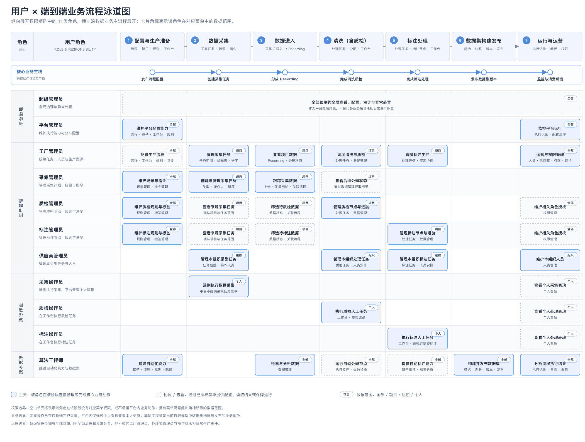
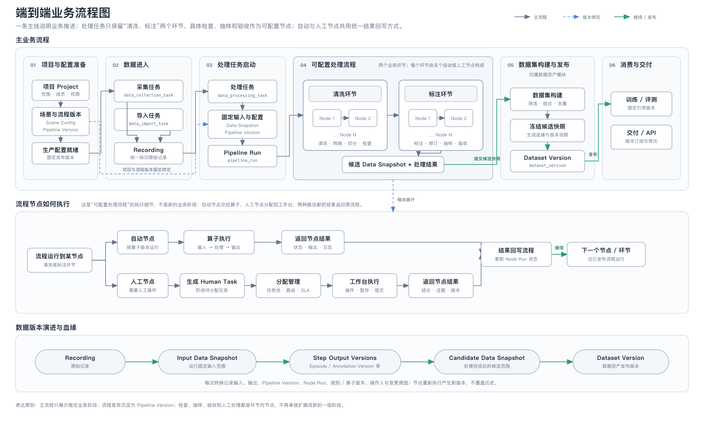
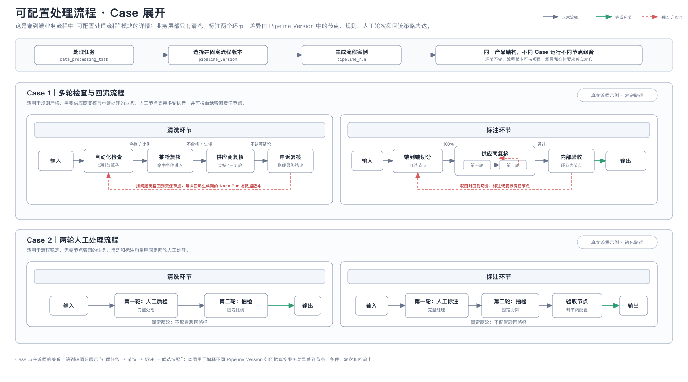
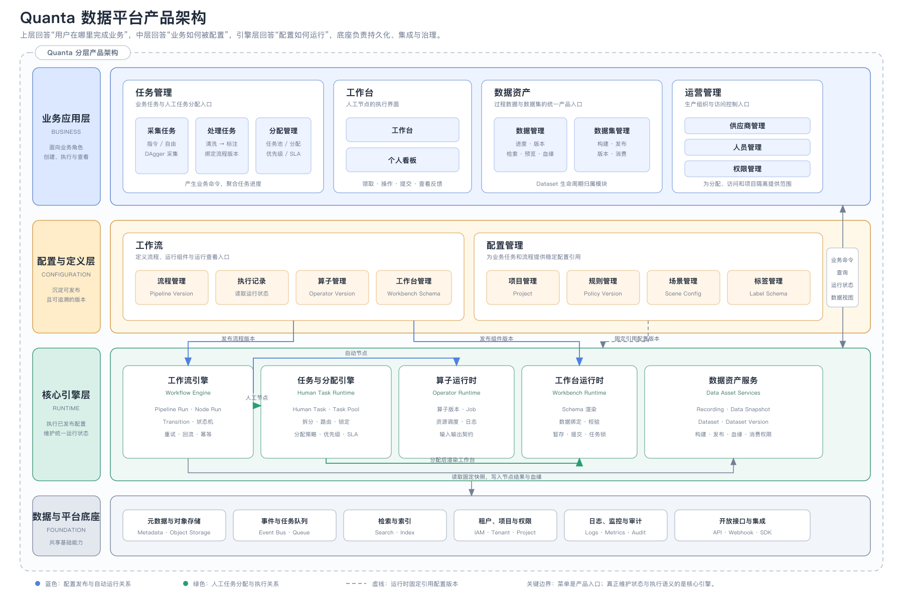
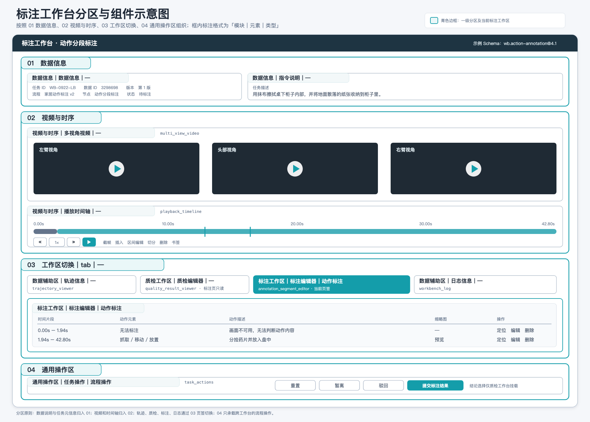

# Quanta 数据平台产品架构调整方案（完善版）

> 本方案聚焦数据 Pipeline，并定义其与数据资产管理、数据工厂经营管理的协作边界，覆盖从数据采集、导入、清洗、标注到数据集构建与发布的完整链路。目标是把流程、任务、工作台组件和数据版本抽象为稳定产品对象，使常规流程可由业务配置，研发可直接进入技术设计。

## 一、范围与目标

### 1.1 产品边界


图中三个模块不是彼此独立的系统：

- **数据 Pipeline 是主业务编排层，也是本期重点建设范围**：统一管理采集、导入和处理任务；处理流程按清洗、标注两个业务环节组织，每个环节由多个自动或人工节点构成，最终输出候选 Data Snapshot、处理结果、血缘信息及数据集构建 / 发布申请。
- **数据资产管理是 Pipeline 的数据底座，也是数据集生命周期的归属模块**：Pipeline 向其写入 Recording 和处理结果，并从中固定引用 Data Snapshot；数据资产管理负责数据集筛选与构建、Dataset Version 冻结、正式发布、废弃、血缘和消费权限。
- **数据工厂经营管理是人工生产的运营支撑层**：Pipeline 下发 Human Task 和工作量，经营管理模块提供人员、技能、任务分配与产能信息，并把分配和执行记录回传 Pipeline。

本期不建设完整的供应商结算或经营 ERP；只定义其与 Pipeline 之间的任务、人员、产能、质量和成本指标接口。租户权限、元数据、存储、消息、监控和审计作为三个模块共享的平台能力统一建设。

### 1.2 核心问题与建设目标

| 当前问题 | 建设目标 | 核心方案 |
|---|---|---|
| 实验与正式流程、不同训练阶段相互干扰 | 多流程并行、稳定、隔离 | 流程版本、运行实例、数据快照分离 |
| 数据重复导入，Recording 与视频缺少稳定唯一关系 | 数据边界清晰、结果可复现 | 唯一标识、幂等键、输入输出版本与血缘 |
| 流程调整依赖研发修改 | 常规流程由业务配置 | 节点、流转、规则、工作台 Schema 配置化 |
| 自动处理和人工处理各自维护状态 | 统一执行与质量闭环 | Node Run、Human Task、Quality Result 统一协议 |
| 质检、标注验收和终验职责混用 | 各质量环节职责清晰 | 统一 Quality Result、PASS / REVIEW / REJECT 与返工流转 |

## 二、用户分析

### 2.1 用户 × 业务环节泳道图



泳道图纵向展开权限矩阵中的 11 类角色，并按平台治理、生产管理、执行作业和技术支撑分组；横向沿“配置与生产准备 → 数据采集 → 数据进入 → 清洗（含质检）→ 标注处理 → 数据集构建发布 → 运行与运营”的业务主流程展开。蓝色实线卡片表示该角色直接管理或完成核心业务动作，灰色虚线卡片表示通过授权菜单提供配置、读取结果或保障运行，卡片角标表示全部、项目、组织或个人数据范围；空白单元格表示没有对应菜单权限或不承担该阶段的平台内动作。

图上方的核心业务主线进一步串联“发布流程配置 → 创建采集任务 → 形成 Recording → 完成清洗质检 → 完成标注处理 → 发布数据集版本 → 监控与消费反馈”，用于从密集的角色泳道中快速识别业务主干。

图中同时明确了三个权限边界：

- 采集操作员在设备端完成采集，平台内只有个人看板和个人数据范围，不授予采集任务管理菜单。
- 平台管理员维护流程、算子、工作台和公共配置并监控运行，不直接管理业务任务和生产数据。
- 当前权限模型中，算法工程师拥有数据集管理的全部数据权限，因此承担数据集构建与发布；工厂管理员负责上游生产组织，但不直接发布数据集版本。

### 2.2 用户角色、职责与授权范围

权限矩阵中的数据范围定义如下：

- **全部数据**：可访问对应菜单下当前平台授权域内的全部数据。
- **项目数据**：仅可访问被授权项目及其关联任务、Recording 和处理结果。
- **组织数据**：仅可访问所属供应商或组织的任务、人员和执行数据。
- **个人数据**：仅可访问分配给本人或由本人执行产生的数据。

| 用户角色 | 角色介绍 | 主要菜单权限 | 数据范围 |
|---|---|---|---|
| 超级管理员 | 负责数据平台全局治理、初始化配置和异常处置，可检查并管理所有业务、配置和运营对象 | 全部菜单 | 全部数据 |
| 平台管理员 | 负责平台执行能力和公共配置的维护，保障流程、算子、工作台及运行记录稳定可用；不直接管理业务任务和生产数据 | 流程管理、执行记录、算子管理、工作台管理、规则管理、场景管理、指令管理、标签管理 | 全部数据 |
| 工厂管理员 | 负责数据工厂整体生产组织，统筹项目任务、供应商、人员、权限、流程配置和执行进度，并处理产能与资源异常 | 采集任务、处理任务、数据管理、供应商管理、人员管理、权限管理、流程管理、执行记录、工作台管理、规则管理、场景管理、指令管理 | 任务与数据为项目数据；运营、工作流和配置类菜单为全部数据 |
| 采集管理员 | 负责授权项目的采集计划、采集任务和数据进度，并维护采集所需的场景与指令配置 | 采集任务、数据管理、场景管理、指令管理 | 任务与数据为项目数据；场景和指令为全部数据 |
| 质检管理员 | 负责授权项目内质检节点的任务安排、进度跟踪和结果查看，并维护质检使用的规则、标签及相关角色授权 | 采集任务、处理任务、数据管理、权限管理、规则管理、标签管理 | 任务与数据为项目数据；权限、规则和标签为全部数据 |
| 标注管理员 | 负责授权项目内标注节点的任务安排、进度跟踪和结果查看，并维护标注使用的规则、标签及相关角色授权 | 采集任务、处理任务、数据管理、权限管理、规则管理、标签管理 | 任务与数据为项目数据；权限、规则和标签为全部数据 |
| 供应商管理员 | 负责本组织承接任务的组织执行和人员维护，只能查看本组织被分配的采集、处理任务及成员数据 | 采集任务、处理任务、人员管理 | 组织数据 |
| 采集操作员 | 按分配要求执行数据采集，并查看本人的采集待办、进度和产出表现；采集作业本身可在设备端或采集工具中完成 | 个人看板 | 个人数据 |
| 标注操作员 | 在工作台领取并执行标注类人工任务，完成数据预览、片段编辑、标注提交和连续下一条，并查看个人表现 | 工作台、个人看板 | 个人数据 |
| 质检操作员 | 在工作台领取并执行质检类人工任务，按规则查看数据、记录问题和提交结论，并查看个人待办与处理表现 | 工作台、个人看板 | 个人数据 |
| 算法工程师 | 负责自动化处理能力和数据资产技术链路，开发算子、编排流程、分析运行结果、维护公共规则配置并构建可消费的数据集 | 数据管理、数据集管理、流程管理、执行记录、算子管理、规则管理、场景管理、指令管理、标签管理 | 全部数据 |

权限设计遵循以下原则：

- **菜单权限与数据权限分离**：拥有菜单不等于可以查看该菜单下的全部数据，实际查询必须继续叠加项目、组织或个人数据范围。
- **管理角色与操作角色分离**：管理员负责范围、规则、任务和资源配置，操作员只处理分配给本人的工作单元。
- **空白即无权**：权限矩阵中未授权的菜单不展示，相关接口也必须执行同样的服务端鉴权。
- **多角色可叠加**：同一人员可以在不同项目或组织拥有不同角色，最终权限为授权关系在对应数据范围内的组合。
- **业务事实不复制**：不同角色读取同一套任务、处理结果和数据版本，只通过视图与数据范围进行隔离。

## 三、端到端业务流程

### 3.1 端到端主流程



业务流程的关键约束：

1. 项目准备并发布流程版本；数据通过采集任务或导入任务进入平台，统一形成具有唯一标识的 `recording`。
2. 数据处理任务绑定流程版本和输入数据范围，生成固定 `pipeline_version_id` 与 `data_snapshot_id` 的 `pipeline_run`。
3. 处理流程固定以清洗、标注作为两个业务环节；检查、抽样、验收和人工处理作为环节内可配置节点，不另设一级业务模块。
4. 自动节点进入算子运行时；人工节点生成 `human_task`，由分配管理通过任务池、路由和 SLA 分配到工作台，提交结果统一回写原 Node Run。
5. Transition 根据节点结果和规则决定继续或返工；返工通过血缘回到责任节点，并生成新的 Node Run、任务记录和数据版本，不覆盖历史。
6. 流程完成后，Pipeline 将候选 Data Snapshot、处理结果和血缘信息提交给数据资产管理；由数据资产管理构建并冻结不可变的 Dataset Version，正式发布后供训练、评测或交付固定引用。

### 3.2 可配置处理流程 Case



该图是端到端主流程中“可配置处理流程”模块的展开详情：

- **Case 1：多轮检查与回流流程**。清洗环节组合自动化检查、抽检复核、供应商复核和申诉复核；标注环节组合端到端切分、供应商多轮复核和内部验收，并支持按血缘回到责任节点。
- **Case 2：两轮人工处理流程**。清洗环节采用人工质检与抽检；标注环节采用人工标注、抽检和验收，按固定两轮执行，不配置驳回路径。
- 两个 Case 共用同一套产品对象和“清洗 → 标注”环节结构，差异沉淀在 Pipeline Version 的节点组合、条件、轮次和回流配置中，不扩展成新的产品模块。

## 四、核心概念

### 4.1 概念关系图


### 4.2 核心对象与边界

| 概念 | Entity Key | 定义与边界 |
|---|---|---|
| 项目 | `project` | 一次业务目标或数据交付的协作、权限和成本边界，不等于流程或数据集 |
| 业务任务 | `data_collection_task` / `data_import_task` / `data_processing_task` | 管理一批工作的业务范围、负责人、进度和交付状态；不替代运行实例或人工任务 |
| 流程定义 | `pipeline_definition` | 可编辑的处理模板，描述环节、节点、流转和回流关系 |
| 流程版本 | `pipeline_version` | 流程发布后的不可变版本；运行实例必须固定引用 |
| 业务环节 | `step` | 面向业务的流程分组和阶段边界；首期处理流程固定为清洗、标注两个环节 |
| 流程节点 | `node` | 最小可编排能力位置，定义输入、输出、执行器和流转条件 |
| 流转 | `transition` | 节点间的条件、分支和回流关系 |
| 流程实例 | `pipeline_run` | 某个项目基于某一流程版本发起的一次隔离运行 |
| 节点实例 | `node_run` | 节点在某次流程运行中的一次实际执行记录 |
| 人工任务 | `human_task` | 人工节点生成的可分配工作单元；进入任务池并在工作台执行 |
| 任务池 | `task_pool` | 人工任务的聚合和分配视图，不拥有业务数据，也不定义流程逻辑 |
| 工作台 Schema | `workbench_schema` | 人工节点使用的布局、组件、数据绑定、校验和提交动作定义 |
| 规则 / 策略版本 | `policy_version` | 定义检查条件、抽检方式和流转条件，被质检、验收节点及 Transition 固定引用 |
| 质量结果 | `quality_result` | 绑定数据版本、规则版本、结论、问题、证据和操作人的结构化记录 |
| 数据快照 | `data_snapshot` | 某次运行固定使用的不可变数据范围，不代表已经发布 |
| 数据集版本 | `dataset_version` | 通过终验、可被下游稳定引用的数据资产版本 |
| 血缘 | `lineage_edge` | 记录输入、输出、流程、规则、算子、人员和版本之间的引用关系 |

### 4.3 三类业务任务

| 业务任务 | Entity Key | 主要输入 | 主要输出 |
|---|---|---|---|
| 数据采集任务 | `data_collection_task` | 项目、采集 SOP、设备/人员、目标数据量 | Recording、采集进度、异常与补采要求 |
| 数据导入任务 | `data_import_task` | 来源、路径、格式、Schema、去重策略 | Recording、导入报告、失败明细 |
| 数据处理任务 | `data_processing_task` | 数据快照、流程版本、处理要求 | 处理结果、质量结果、新数据版本 |

`data_processing_task` 不再按质检、标注分别建立业务任务类型，而是绑定一个完整的 Pipeline Version。首期流程统一包含：

- **清洗环节**：可组合格式校验、去重、清洗、切分、自动检查和人工处理等节点。
- **标注环节**：可组合首次标注、修订、抽验和验收等自动或人工节点。

不同业务通过选择流程版本获得不同节点组合和参数，但不改变“清洗 → 标注”的环节层级。流程完成后，Pipeline 向数据资产管理提交候选快照和构建申请；数据资产管理负责形成并发布 Dataset Version。业务任务负责范围、进度和交付状态；节点实例和人工任务负责具体执行。

对象关系约束：

- 一个 `data_collection_task` 或 `data_import_task` 可以产生多个 Recording；Recording 必须记录来源任务类型和任务 ID。
- 一个 `data_processing_task` 固定绑定一个 Pipeline Version 和一个输入 Data Snapshot，并生成一个或多个 Pipeline Run。
- Pipeline Run 包含 Node Run；只有人工节点的 Node Run 才生成 Human Task。

## 五、产品架构



产品架构按职责分为四层。菜单是面向角色的产品入口，不直接等同于底层领域服务或执行引擎：

| 架构层 | 包含内容 | 核心职责 |
|---|---|---|
| 业务应用层 | 任务管理、工作台、数据资产、运营管理 | 面向不同角色提供任务创建、人工执行、数据消费和组织治理入口；发起业务命令并展示运行状态 |
| 配置与定义层 | 工作流、配置管理 | 把流程、算子、工作台、项目、规则、场景和标签沉淀为可发布、可追溯的版本配置 |
| 核心引擎层 | 工作流引擎、任务与分配引擎、算子运行时、工作台运行时、数据资产服务 | 执行已发布配置，维护 Pipeline Run、Node Run、Human Task、数据版本及血缘等统一运行状态 |
| 数据与平台底座 | 元数据与对象存储、事件与任务队列、检索、权限、日志审计、开放接口 | 提供跨模块共享的持久化、消息、检索、治理、可观测性和集成能力 |

产品导航仍由六个一级模块组成；其中工作流与配置管理的菜单主要承担配置与定义职责：

| 模块 | 菜单 | 功能边界 |
|---|---|---|
| 任务管理 | 采集任务 | 新建、查看和编辑数据采集任务；支持指令采集、自由采集和 DAgger 采集三种模式，可配置所属项目、优先级和操作人，并可选择关联处理任务，使采集产生的数据持续进入指定处理流程 |
| 任务管理 | 处理任务 | 新建、查看和编辑数据处理任务；按清洗、标注两个业务环节查看节点进度，为不同业务绑定不同流程，并跟踪任务范围、执行人、优先级及关联数据 |
| 任务管理 | 分配管理 | 处理三类生产调度场景：对积压中的流式任务重新指派供应商和处理人；为未绑定数据指定处理任务与处理流程；按项目、来源、处理状态等条件筛选已有数据并发起再处理 |
| 数据资产 | 数据管理 | 以 Recording 为主线统一检索采集和导入数据；查看多路视频、上传状态、采集结论、质检结论、标注状态及关联处理流程，并在详情中查看处理版本和操作记录 |
| 数据资产 | 数据集管理 | 按业务目录组织数据集；支持从 Recording 筛选数据、配置采样配方和 train / val / eval 划分、生成快照，并管理数据集版本的构建、发布、回滚和下游引用 |
| 运营管理 | 供应商管理 | 维护外部供应商的服务类型、服务范围、人员规模、协议有效期和交付状态，并汇总供应商人员、当期交付及待处理事项 |
| 运营管理 | 人员管理 | 维护平台自有及供应商人员的组织归属、技能、可承接任务等级、工作状态和最近活跃时间，为分配管理提供可用人员范围 |
| 运营管理 | 权限管理 | 通过角色、资源和授权关系控制访问；分别维护角色成员与菜单范围、项目 / 任务 / 数据集 / 配置等资源及其可授权动作，以及授权人、权限和有效期 |
| 工作台 | 工作台 | 承接分配给当前用户的人工任务；展示任务范围、SOP 和处理规则，提供多模态预览、时间轴与片段编辑、标注录入、暂存、提交和连续处理下一条等能力 |
| 工作台 | 个人看板 | 仅展示当前用户的待办和执行数据；查看优先级与 SLA 风险、完成量、一次通过率、平均耗时、近 7 日趋势、分环节表现及项目内排名 |
| 工作流 | 流程管理 | 将算子编排为可复用流程；支持新增和编辑流程、拖拽节点与连线、配置节点运行环境和出入参、引用流程变量，并设置手动执行或周期调度 |
| 工作流 | 执行记录 | 按流程、状态和触发方式查询每次流程执行实例；查看产出对象、触发人、开始时间、耗时和运行状态，并支持查看日志与重新执行 |
| 工作流 | 算子管理 | 将原子处理能力注册为可编排算子；维护唯一标识、运行镜像、入口脚本、请求参数和返回结果，支持启停、关联流程、运行及保存新版本 |
| 工作流 | 工作台管理 | 配置人工任务使用的 Workbench Schema，维护页面区域、组件组合和发布状态；同时注册并管理多模态预览、时间轴、标注编辑、证据面板等可复用组件 |
| 配置管理 | 规则管理 | 维护流程节点可引用的检查、切分和标注规则；配置规则分类、执行方式和具体参数，并支持新增、编辑、启用和停用 |
| 配置管理 | 场景管理 | 维护可被采集任务复用的场景定义，包括场景名称、环境描述、任务道具以及参考图片和视频，并支持新增、查看、复制和删除 |
| 配置管理 | 指令管理 | 维护采集任务下发到设备端或供应商前使用的指令模板，包括动作指令树、多模态触发条件、物料清单和异常回报规则 |
| 配置管理 | 标签管理 | 维护带版本的多级标签体系，按维度、分类和子标签组织中英文名称及说明，为数据筛选、标注 Schema 和规则配置提供统一枚举 |

层级与模块关系遵循以下边界：

1. **业务应用层发起命令、读取状态，但不维护运行语义**：任务管理、工作台和数据资产页面不能直接修改底层流程状态或数据版本。
2. **配置与定义层产出不可变版本**：流程、算子、工作台 Schema、规则和标签发布后形成固定版本，由运行实例显式引用。
3. **核心引擎层维护运行事实**：工作流引擎负责节点编排和状态流转；任务与分配引擎负责 Human Task、任务池、拆分、路由和 SLA。
4. **自动节点与人工节点使用不同运行时**：自动节点进入算子运行时；人工节点生成 Human Task，经分配后进入工作台运行时，提交结果回写 Node Run。
5. **数据资产服务维护数据事实和生命周期**：引擎固定读取 Data Snapshot，将节点结果和血缘写回；Dataset 与 Dataset Version 的构建、发布及消费由数据资产服务负责。
6. **数据与平台底座不承载业务状态机**：只提供持久化、队列、权限、审计、检索和开放接口等共享能力。

## 六、功能概要

### 6.1 流程配置抽象

| 模块 | 必需能力 | 关键配置 | 运行产物 |
|---|---|---|---|
| 项目配置 | 创建项目、成员授权、数据范围、交付标准 | 角色、数据域、质量目标、成本归属 | Project |
| 流程定义 | 新建、复制、编辑、校验、试运行 | 环节、节点、连线、异常出口 | Pipeline Definition |
| 流程发布 | 差异检查、版本说明、审批、冻结 | 节点版本、规则版本、算子版本 | Pipeline Version |
| 环节配置 | 组织业务阶段并设置完成条件 | 输入范围、完成条件、责任角色 | Step |
| 节点配置 | 选择执行类型并绑定输入输出 | 执行器、参数、工作台、超时重试 | Node |
| 流转配置 | 配置条件、分支、跳过和回流 | 表达式、优先级、目标节点 | Transition |
| 运行管理 | 发起、暂停、取消、重试、补数 | 输入快照、运行参数、幂等键 | Pipeline Run / Node Run |

节点类型统一为：

| `node_type` | 作用 | 执行器 |
|---|---|---|
| `operator` | 自动清洗、切分、转换、检测或标注 | Operator Runtime |
| `human` | 生成需要人工完成的工作单元 | Human Task Runtime |
| `gateway` | 仅根据表达式进行分支、合流或跳过 | Workflow Engine |

所有节点使用同一执行契约：

- 输入：`data_snapshot_id`、上游结果、业务参数。
- 执行：执行器版本、资源或工作台 Schema。
- 输出：新数据快照、结构化结果、证据。
- 控制：超时、重试、抽检、转人工、跳过、回流。
- 审计：操作人、执行时间、规则/算子版本和变更原因。

### 6.2 任务池与分配规则

采集任务或数据导入任务已经绑定处理任务，且处理任务已经绑定处理流程时，数据按照绑定关系自动进入流程执行，不需要人工逐批分配。分配管理只处理正常流转之外的资源调整、关系补建和数据再处理；流程中的人工节点生成 `human_task` 后，才进入人工任务池供操作员领取和执行。

#### 6.2.1 分配管理

当前代码中的分配管理按项目视角组织，提供“资源调度、处理绑定、数据再处理”三个页签，对应三类人工介入场景：

| 场景 | 触发条件与处理对象 | 筛选条件 | 可执行操作 | 保持不变 / 处理结果 |
|---|---|---|---|---|
| 资源调度 | 采集或导入的输入速度持续高于当前处理吞吐，造成处理任务积压或长时间滞留 | 项目、处理环节、采集/导入任务 ID、处理任务 ID、当前供应商、当前处理人 | 对单个或多个积压任务重新指派供应商和处理人，并记录指派原因 | 采集/导入任务、处理任务、处理流程及当前处理环节均保持不变；只更新任务的执行资源 |
| 处理绑定 | 采集或导入数据已经进入数据池，但来源任务没有绑定处理任务，数据尚未进入任何处理流程 | 项目、数据来源、采集/导入任务 ID；支持按数据池批次单选或批量选择 | 指定处理任务，为该任务绑定处理流程，并设置优先级 | 原始数据和来源任务保持不变；补齐“数据批次 → 处理任务 → 处理流程”的绑定关系后进入处理 |
| 数据再处理 | 因新的训练、评测或交付要求，需要对已有数据重新执行一套处理逻辑；数据可以处于未处理、处理中或已完成状态 | `recording_id`、项目、数据来源、来源任务 ID、质检结论、标注状态、已有处理流程 | 输入再处理任务名称，选择处理流程和优先级，并决定原流程继续运行或终止 | 不覆盖原数据、原结果和历史记录；创建新的再处理任务及流程执行，形成新的处理结果和血缘关系 |

三类场景的关键规则如下：

1. **资源调度只换执行资源。** 重新指派供应商或处理人不能改变处理任务、处理流程和数据范围，避免用人员调度隐式改变业务逻辑。
2. **处理绑定只补建缺失关系。** 仅允许操作尚未进入任何处理任务的数据；一旦完成绑定，后续按照所选处理流程正常流转。
3. **数据再处理创建新的执行。** 页面中的“发起再处理”不是创建新的流程定义，而是复用已发布的处理流程版本，新建再处理任务并发起一次新的流程执行。原流程是否继续由发起人明确选择。
4. **批量操作以筛选结果和勾选对象为边界。** 系统在提交前展示命中任务数、批次数或数据量；项目视角切换后清空原勾选项，并重新计算当前范围内的可见对象和数据量。

#### 6.2.2 人工任务池

处理流程执行到人工节点时，系统为对应数据范围生成 `human_task`。人工任务保留业务任务、Pipeline Run 和 Node Run 的完整关联，并携带数据范围、SOP、优先级、SLA、执行人和锁定状态。

| 状态 / 操作 | 规则 |
|---|---|
| 待领取 | 任务状态为 `pending`，尚未绑定执行人且未锁定；操作员可领取单条任务，也可按优先级领取下一条任务 |
| 领取与锁定 | 领取后写入执行人和锁定截止时间，状态进入 `in_progress`，避免同一任务被多人同时处理 |
| 进入工作台 | 仅处理中任务进入与节点绑定的工作台，并按任务携带的数据范围和 SOP 执行 |
| 提交 | 工作台提交结构化结果后回写原 Node Run，由流程引擎继续执行后续节点；任务池本身不修改处理流程 |

因此，业务任务负责一批数据的目标和总体进度，人工任务负责其中一个人工节点的一次具体执行；二者不能合并为同一实体。

### 6.3 工作台与交互组件

工作台不是独立业务对象，而是由 `workbench_schema` 组合组件形成的执行界面。下表按当前代码中的 `WORKBENCH_COMPONENTS`、`WORKBENCH_SCHEMAS` 和实际页面交互整理；“适用工作台”描述界面复用范围，不新增业务环节。其中，质检工作台服务于清洗环节中的人工质检类节点，详情工作台用于只读查看或验收类节点。

以下以标注工作台 `wb.action-annotation@4.1` 为例，按照“数据信息、视频与时序、工作区切换、通用操作区”四个一级分区逐块框出页面结构；每个标题均按“模块｜元素｜类型”标注，并附对应 Component Key。



| 模块 | 元素 | Component Key | 类型 | 适用工作台 | 功能说明 |
|---|---|---|---|---|---|
| 任务上下文 | 任务说明 | `instruction_context` | 上下文 | 质检、标注 | 展示采集指令、任务描述、处理规则及当前任务上下文，帮助操作员按同一规则执行。 |
| 视频与时序 | 多视角视频 | `multi_view_video` | 视频 | 质检、标注、详情 | 同步展示头部、左臂、右臂三路视频，支持播放、放大、录屏及逐帧定位。 |
| 视频与时序 | 播放时间轴 | `playback_timeline` | 时序交互 | 质检、标注 | 将视频播放位置与质检问题区间、标注片段映射到同一时间轴；标注时支持上一帧、下一帧、倍速播放、截帧、插入、区间编辑、切分、删除和书签。 |
| 数据辅助区 | 轨迹信息 | `trajectory_viewer` | 数据可视化 | 质检、标注、详情 | 查看关节、末端位姿、夹爪状态和控制轨迹，辅助核对视频动作与机器人状态是否一致。 |
| 质检工作区 | 质检记录 | `quality_issue_editor` | 区间质检 | 质检 | 记录失误起止时间、严重程度和问题描述，可维护多条问题区间并删除错误记录。 |
| 标注工作区 | 标注编辑器 | `annotation_segment_editor` | 动作分段与语义描述 | 标注 | 按时间切分动作片段，维护开始/结束时间、动作元素和动作描述；“语义标注”在当前实现中由动作元素与动作描述承载，不是独立工作台或独立组件。 |
| 结果查看区 | 质检信息 | `quality_result_viewer` | 只读结果 | 标注、详情 | 展示质检规则版本、质检结论、问题区间和问题描述，使标注人员和查看者能够定位已有问题。 |
| 结果查看区 | 标注信息 | `annotation_result_viewer` | 只读结果 | 详情 | 按 High-level / Low-level 层级展示动作描述、起止时间和标注规则版本。 |
| 结果查看区 | 标签信息 | `tag_viewer` | 只读标签 | 详情 | 汇总场景、动作、设备和质量标签，用于快速理解数据内容与适用范围。 |
| 通用操作区 | 结论选择 | `conclusion_selector` | 业务结论 | 质检、标注、详情 | 提供“合格、不合格、操作失误”三类结论；选择结论后才允许提交。 |
| 通用操作区 | 处理日志 | `workbench_log` | 操作记录 | 质检、标注、详情 | 记录任务领取、数据查看、草稿保存、提交和退回等过程，支持处理过程追溯。 |
| 通用操作区 | 任务操作 | `task_actions` | 流程动作 | 质检、标注、详情 | 当前页面提供重置、暂离、驳回和提交；Schema 中的持久化流程动作是 `submit`、`reject`。 |

适用范围以工作台 Schema 和实际渲染为准：质检、标注工作台挂载可编辑组件；详情工作台只挂载质检结果、标注结果和标签等只读组件，不直接修改质检记录或标注片段。

`workbench_schema` 至少包含：

```yaml
layout:
  regions: [context, video, tabs, decision, actions]
components:
  - component_key: instruction_context
  - component_key: multi_view_video
  - component_key: playback_timeline
  - component_key: trajectory_viewer
  - component_key: quality_issue_editor
  - component_key: conclusion_selector
  - component_key: workbench_log
  - component_key: task_actions
actions: [submit, reject]
validation:
  submit: [conclusion_selected, issue_time_range_valid]
```

业务配置只负责选择和组合已注册组件；新增底层组件、复杂标注工具或自动化算子仍由研发交付。

### 6.4 数据、质量与版本

| 数据对象 | 产生方式 | 关键字段 | 版本关系 |
|---|---|---|---|
| `recording` | 采集或导入 | 来源、设备、时间范围、模态、校验和 | 原始数据不可覆盖 |
| `episode` | 切分节点 | recording_id、时间段、切分版本 | 多个 Episode 可来自同一 Recording |
| `annotation_version` | 标注提交或修订 | episode_id、schema、内容、提交人 | 修订必须生成新版本 |
| `quality_result` | 自动检查或人工提交 | 对象版本、来源节点、规则、结论、问题、证据 | 改判保留前后结果 |
| `data_snapshot` | Run 发起、节点输出或终验冻结 | 数据范围、查询条件、成员清单、校验和 | 是运行隔离和复现基础 |
| `dataset_version` | 终验通过后发布 | snapshot_id、质量状态、版本说明 | 发布后不可变 |
| `lineage_edge` | 每次处理或发布自动写入 | source、target、relation、run、actor | 连接数据、流程、任务与质量 |

节点幂等键建议：

```text
idempotency_key = hash(
  input_snapshot_id
  + pipeline_version_id
  + node_id
  + executor_version
  + normalized_parameters
)
```

### 6.5 领域命令与事件边界

以下语义可直接进入接口和事件设计：

| 领域动作 | Command / API 语义 | 成功事件 | 关键校验 |
|---|---|---|---|
| 发布流程 | `publish_pipeline_version` | `PipelineVersionPublished` | 配置完整、依赖版本存在、审批通过 |
| 发起运行 | `start_pipeline_run` | `PipelineRunStarted` | 项目权限、输入快照、幂等键 |
| 创建业务任务 | `create_business_task` | `BusinessTaskCreated` | task_type 与输入范围合法 |
| 领取人工任务 | `claim_human_task` | `HumanTaskClaimed` | 任务未占用、技能和项目权限匹配 |
| 提交人工结果 | `submit_human_task` | `HumanTaskSubmitted` | 锁有效、表单校验通过、版本未冲突 |
| 创建返工 | `create_rework_order` | `ReworkOrderCreated` | 原因、责任节点和目标范围明确 |
| 提交数据集构建申请 | `submit_dataset_build_request` | `DatasetBuildRequested` | 终验 PASS、候选快照已固定、质量结果和血缘完整 |
| 发布数据集（数据资产服务） | `publish_dataset_version` | `DatasetVersionPublished` | 已收到构建 / 发布申请、终验 PASS、血缘完整、版本未重复 |

## 七、进入技术设计前的约束

1. 已发布的流程、规则、算子、工作台 Schema 和数据集版本均不可原地修改。
2. 页面不得直接修改 Pipeline Run、Node Run 或 Quality Result 状态，只能调用领域命令。
3. 自动节点和人工节点都必须绑定输入数据快照，并产生可追溯的结构化输出。
4. Human Task 必须关联业务任务、Pipeline Run、Node Run、数据范围、SOP、优先级和 SLA。
5. Quality Result 必须关联被判断的数据版本、规则/策略版本、执行者和证据。
6. 任一重试、复核、改判或返工都生成新记录，不覆盖历史事实。
7. 下游训练、评测和交付只能引用已发布的 Dataset Version。
8. 租户、项目、任务、数据和质量结果使用同一套权限与审计链路。

## 八、一期建设范围

一期必须完成：

- 三类业务任务及其进度管理。
- Pipeline Definition、Version、Run 和 Node Run。
- `operator`、`human`、`gateway` 三类基础节点；质检和验收由这些节点组合实现。
- 任务池、领取/指派、SLA、任务锁和连续作业。
- 工作台 Schema 与首批通用交互组件。
- 采集质检、标注验收、数据集终验，以及统一质量结果和返工闭环。
- Recording、Episode、Annotation Version、Data Snapshot、Dataset Version 和基础血缘。
- 项目级权限、版本冻结、幂等、日志和审计。

供应商结算、智能抽检、质量异常聚类和智能任务分配可在基础对象与数据口径稳定后建设。
