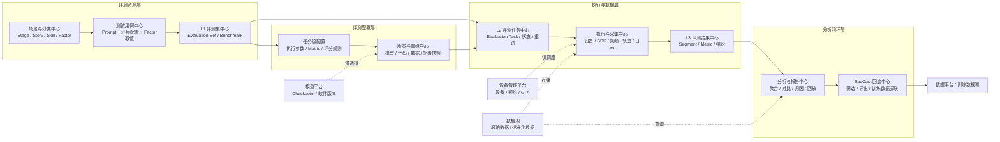
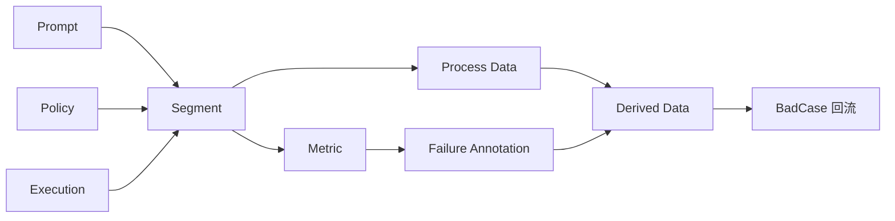

# 新评测功能方案

## 一、产品定位

新评测功能是一套面向具身智能模型的评测数据管理与执行平台。核心采用三层数据模型：L1 评测集（Evaluation Set）、L2 评测任务（Evaluation Task）、L3 评测结果（Segment），完成从任务创建、执行采集、数据入湖、异步标准化到结果分析和 BadCase 回流的闭环。

平台提供通用的资源、任务、采集、分析和版本能力；业务侧通过配置评测规则、指标、通过条件和报告模板适配不同评测场景，不需要因业务规则变化频繁修改平台代码。

## 二、产品架构



## 三、模块职责

### 1. 场景与分类中心

统一维护评测的业务分类和影响因素，形成 `Stage → Story → Skill / Factor → 测试用例` 的层级。

- `Stage`：评测大类，例如预训练 Benchmark、端到端操作评测。
- `Story`：独立的测试任务或场景，区分能力专项和场景专项。
- `Skill`：被测的原子能力，例如抓取、放置、物品识别。
- `Factor`：影响能力表现的可测量变量，例如物体材质、空间位置、光照和干扰物。
- 管理 Factor 的默认值、取值范围、数据类型及其可关联的场景。

该中心只描述“评测什么”和“变量是什么”，不负责一次任务的执行。

### 2. 测试用例中心

将一个可执行的测试单元标准化为 Prompt、环境配置和 Factor 取值的组合。

- 支持从场景、Skill 和 Factor 组合生成测试用例。
- 支持单变量控制，保证能力专项可以进行可解释的对比。
- 支持测试用例启停、复制、批量导入和版本冻结。
- 为每条用例保留唯一 ID，确保结果和历史任务可追溯。

测试用例是评测集的基础，不直接绑定某个模型版本。

### 3. 评测集中心（L1 Evaluation Set）

管理可复用的评测集和 Benchmark，评测集相当于一套可重复使用的“卷子”。

- 维护 `eval_set_id`、名称、语义化版本、场景和描述。
- 保存 Prompt 列表，每个 Prompt 包含 ID、文本、标签和 Prompt 级配置。
- 保存可选的任务级预设配置，以及 Metric 字段定义。
- 支持版本化、复用、复制、发布和历史版本查看。

评测集发布后形成不可变快照，任务只引用已发布版本，避免执行中的配置被修改。

### 4. 任务级配置能力（不单独形成顶层对象）

评测规则和执行参数直接作为评测集或评测任务的配置，不额外引入独立的“评测方案”实体。

- 任务级配置：每个 Prompt 执行次数、超时时长、采集内容、Metric 和评分规则。
- Prompt 级配置：单条 Prompt 的环境参数、Factor 取值和特殊执行参数。
- 生成任务时将配置写入快照，后续修改不影响已创建任务。

这层只负责描述“本次任务怎么测”，不改变 L1 评测集的复用和版本边界。

### 5. 版本与血缘中心

统一记录一次评测依赖的模型、Checkpoint、代码、数据、设备软件和配置版本。

- 记录模型版本与对应训练任务、代码提交和软件包版本。
- 记录评测集、Prompt 配置、Metric 和测试用例版本。
- 记录任务与结果之间的完整上下游关系。
- 对执行配置做快照，支持结果复现和版本间对比。

该中心不产生评测结果，但为任务创建、结果解释和问题定位提供唯一依据。

### 6. 评测任务中心（L2 Evaluation Task）

基于一个已发布的评测集，指定待测模型/Policy 和执行参数，形成一次具体的评测活动。

- 绑定一个评测集和一个或多个被测 Policy，支持多模型同测。
- 通过 `repeat_count` 配置每个 Prompt 的执行次数，用于稳定性统计和平均值计算。
- 记录任务状态、执行参数和创建/开始/结束时间。
- 负责任务创建、下发、排队、暂停、恢复、取消、重试和整体复制。
- 展示任务下各 Policy 的执行进度，并支持按模型分组对比结果。

任务创建后固定引用评测集 ID 和版本，不能反向修改已发布评测集的内容。

### 7. 执行与采集中心

连接模型运行环境、机器人设备和评测 SDK，完成测试用例的实际执行与过程数据采集。

- 下发 Prompt、环境配置和运行参数。
- 采集视野信息、三方视频、MozTrace、本体执行轨迹、Action Chunk 和下发时延。
- 每个 Prompt 执行完成后上传过程数据和结果，生成对应的 Segment。
- 支持设备预约、任务拉取、失败重试和执行状态回报。
- 对原始过程数据进行格式转换、时间对齐、元数据索引、质量评估并入湖。

该中心只负责“执行并记录事实”，评分规则和业务结论由结果与分析模块处理。

### 8. 评测结果中心（L3 Segment）

以 Segment 作为评测结果的最小记录单元，统一承载基础元数据、评测关联元数据、Metric、过程数据和衍生数据。

`Segment = 1 个 Prompt × 1 个 Policy × 1 次执行`

- 关联 `task_id`、`eval_set_id`、评测集版本、Prompt 快照、Policy 版本和设备。
- 记录 `repeat_index`、`repeat_group_id`、开始/结束时间、执行状态和测试人员。
- 记录自定义 Metric，以及一级/二级失败分类和失败原因。
- 关联三方视频、`robot_state`、`moz_trace`、`sensor_data` 等过程数据。
- 维护关键帧、动作分段、BadCase 标记和人工备注等衍生数据。

结果管理中心为分析、回放和 BadCase 筛选提供统一数据接口。

### 9. 分析与报告中心

将结果按不同维度聚合，回答“模型表现如何、哪里失败、为什么失败”。

- 按模型、Checkpoint、评测集版本、Stage、Story、Skill、Factor 和 Metric 聚合。
- 支持模型横向对比、版本回归对比和单 Factor 影响分析。
- 统计成功率、通过率、平均分、耗时、稳定性和失败分布。
- 提供从汇总结果下钻到 Segment、视频和执行轨迹的回放能力。
- 根据报告模板生成可分享、可导出的评测报告。

分析只读取已完成或满足分析条件的结果，避免对执行中的数据产生错误结论。

### 10. BadCase 回流中心

把评测中识别出的失败样本转化为可用于训练和问题跟踪的数据资产。

- 从结果列表或回放页面标记 BadCase，并选择失败分类和原因。
- 批量筛选、去重、补充说明和关联模型版本。
- 将原始视频、轨迹、Prompt、Factor 和结论导出或回流数据平台。
- 保留 BadCase 与原评测任务、结果 Segment 和训练数据集版本的血缘关系。

该中心是评测结果到训练数据湖的出口，不直接承担训练任务编排。

## 四、模块之间的关系

### 资源关系

场景与分类中心定义业务语义，测试用例中心将语义落成可执行单元，评测集中心把 Prompt 组织成可复用版本。任务级配置补充本次执行参数，但不改变评测集定义。

### 执行关系

评测任务中心基于已发布评测集创建任务快照，并绑定多个 Policy、代码、设备和执行参数；执行与采集中心按任务快照运行，评测结果中心接收每次执行产生的 Segment。

### 分析关系

评测结果中心将结构化元数据和评分同步至 OLAP，将原始过程数据保存在数据湖；分析与报告中心基于 OLAP 聚合、基于数据湖点查，所有分析结论都可以下钻回具体 Segment。

### 平台集成关系

- 模型平台提供 Checkpoint、模型软件版本和部署能力。
- 设备管理平台提供设备状态、预约和 OTA 能力。
- 数据湖保存原始视频、轨迹、日志和标准化结果。
- 数据平台接收 BadCase，形成训练数据集或后续标注任务。

## 五、端到端主链路

```text
维护场景与 Factor
  → 生成并发布测试用例
  → 创建并发布评测集（Prompt 集合）
  → 选择评测集、Policy 和执行参数创建任务快照
  → 调度执行与采集过程数据
  → 上传数据并异步标准化，生成 Segment 和 Metric 结果
  → 聚合分析、对比、归因和回放
  → 标记 BadCase 并回流数据平台
```

## 六、核心对象与原子事实（按数据湖方案对齐）

这份方案采用文档中的三层产品模型。L1、L2、L3 是平台的核心对象层级；Prompt、Policy、Metric 和过程数据是 Segment 内可复用、可追溯的原子事实，不另造一套“评测方案 / Run / Evidence”顶层对象。

### 三层核心对象

| 层级 | 对象 | 定义 | 关键关系 |
| --- | --- | --- | --- |
| L1 | **Evaluation Set（评测集）** | Prompt 的集合，相当于一套可复用的“卷子” | 一个评测集拥有多个 Prompt，按场景组织并进行版本管理 |
| L2 | **Evaluation Task（评测任务）** | 一次具体评测活动，指定评测集、Policy 和执行参数 | 一个任务引用一个评测集版本，可同时评测多个 Policy，并控制每个 Prompt 的重复次数 |
| L3 | **Segment（评测结果）** | 一个 Prompt 在一个 Policy 下的一次执行记录 | `Segment = 1 Prompt × 1 Policy × 1 次执行`，是入湖、查询和聚合的最小单元 |

### Segment 内的原子事实

| 概念 | 定义 | 在 Segment 中的作用 |
| --- | --- | --- |
| **Prompt** | 指令文本及其标签、Prompt 配置快照 | 说明“考哪一道题”，支持按场景和标签检索 |
| **Policy** | 被测模型/策略及名称、版本、Checkpoint 路径、代码分支 | 说明“由哪个模型作答”，支持多模型同测和版本对比 |
| **Execution** | 本次执行的序号、重复组、开始/结束时间、状态和测试人员 | 区分同一 Prompt、同一 Policy 的多次执行，支持稳定性统计 |
| **Metric** | 自定义指标及其值、类型和计算规则 | 承载成功率、完成时长等评分结果，支持扩展字段 |
| **Failure Annotation** | 一级/二级失败分类、失败原因和人工备注 | 把结果转化为可分析、可归因的问题信息 |
| **Process Data** | 三方视频、robot state、MozTrace、传感器数据等原始过程数据 | 支持回放、点查、复核和后续标准化处理 |
| **Derived Data** | 关键帧、动作分段、质量分、`is_badcase` 等衍生字段 | 支持分析、筛选和 BadCase 回流 |

### 数据链路



最小事实链是：

```text
Evaluation Set → Evaluation Task → Segment
Prompt + Policy + Execution → Segment → Process Data / Metric / Failure Annotation
```

这版方案先固定三层核心对象和 Segment 数据边界，后续再细化字段、页面、权限、接口和 MVP 范围。
