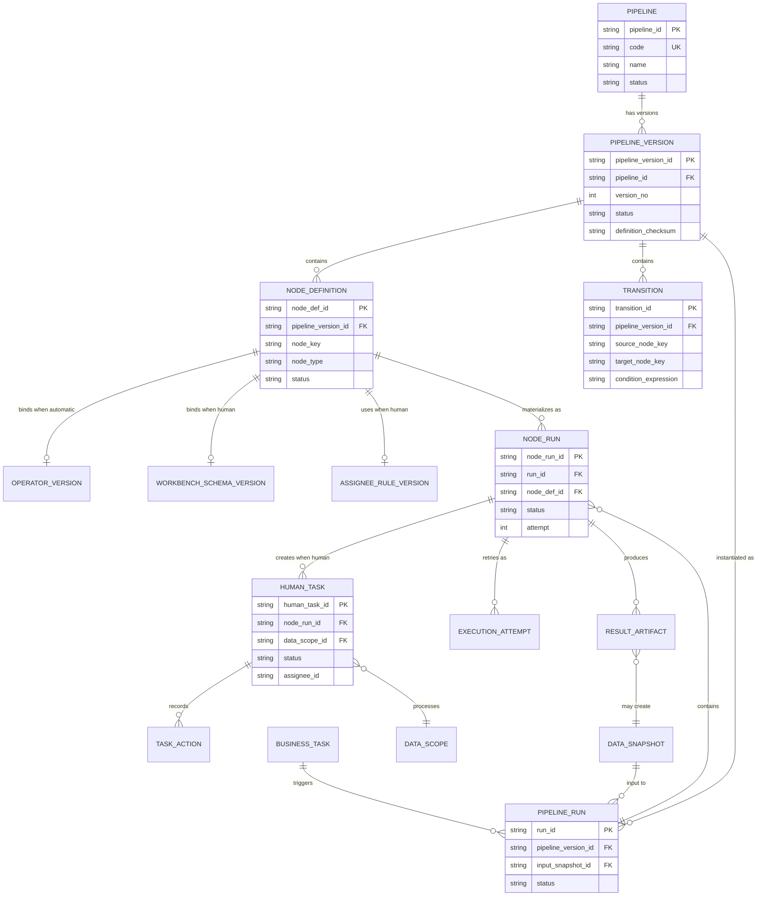
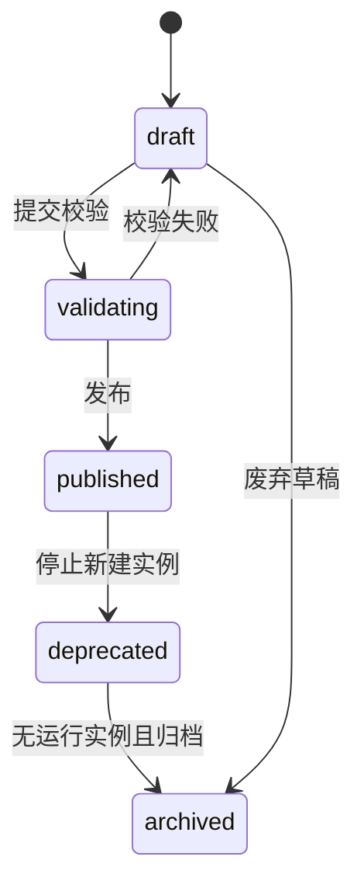
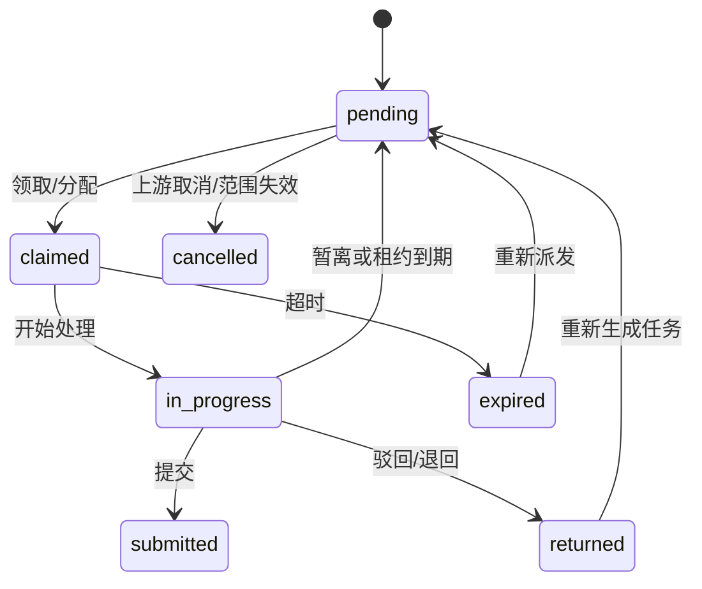
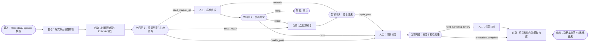

# 具身数据处理 Pipeline 流程引擎方案

> 版本：v1.0  
> 适用范围：具身数据的质检、标注、后处理 Pipeline  
> 设计基线：参考审批流引擎的「表单、流程、处理人均可配置」模式；保留数据处理场景中的批处理、自动算子、可追溯数据快照与人工任务池能力。

## 1. 目标与边界

本方案提供一套以**版本化流程定义**驱动的流程引擎：数据进入 Pipeline 后，由自动化算子、人工处理节点和包容网关共同编排；每次执行固定绑定一个已发布的流程版本及其依赖版本，保证结果可复现、可审计、可回放。

核心目标：

- 支持对质检、标注、后处理的统一编排，而不是为每个业务环节维护独立流转逻辑。
- 支持审批流式的配置能力：人工节点的工作台（表单）、候选处理人规则、可执行动作及驳回目标均可配置。
- 支持自动化处理：节点绑定不可变的算子版本、输入输出契约、参数与重试策略。
- 使用**包容网关（Inclusive Gateway）**按数据结果选择零到多个满足条件的分支，并在规定的已激活分支全部完成后再合流。
- 对每条数据或数据分片保留输入快照、规则版本、算子/工作台版本、处理人和结果证据，形成端到端血缘。

不在本期范围：跨流程事务、任意脚本执行沙箱、复杂 BPMN 事件子流程。需要定时触发时，将其作为流程实例的触发器配置，而非新增节点类型。

## 2. 核心概念

| 概念 | 说明 | 关键约束 |
| --- | --- | --- |
| 流程（Pipeline） | 面向业务的逻辑流程，如“具身数据质检与标注”。 | 仅承载元信息和版本集合，不直接执行。 |
| 流程定义版本（Pipeline Version） | 可编辑画布发布后的不可变版本，包含节点、连线、变量和依赖快照。 | 运行实例必须绑定一个已发布版本。 |
| 节点定义（Node Definition） | 某流程版本中的一个编排节点；可为自动、人工或网关。 | `node_key` 在同一版本内唯一；配置随版本冻结。 |
| 连线（Transition） | 节点间的流转关系；可带条件、优先级、默认分支与合流语义。 | 条件只读取已声明的上下文变量。 |
| 算子版本（Operator Version） | 自动节点调用的原子处理能力，例如时间戳对齐、质量规则检测、数据集构建。 | 必须声明输入输出 Schema，并支持幂等。 |
| 工作台 Schema | 人工节点呈现的页面/表单/组件配置，可理解为审批流中的表单版本。 | 发布后冻结；任务提交结果需满足 Schema。 |
| 候选人规则 | 人工节点的处理人路由规则，如用户组、技能、组织、数据标签、负载。 | 运行时解析成候选人快照，避免组织变更影响历史。 |
| 流程实例（Pipeline Run） | 一次针对数据快照或数据集合的执行。 | 绑定流程、依赖配置和输入数据快照。 |
| 节点实例（Node Run） | 流程实例在一个节点上的实际执行记录；对分片可生成多个实例。 | 每次重试保留 attempt 和原因。 |
| 人工任务（Human Task） | 由人工节点产生、可领取或分配的最小人工工作单元。 | 关联唯一 Node Run 与数据分片，可租约锁定。 |
| 数据快照（Data Snapshot） | 不可变输入或输出数据集合，以及成员、校验和、Schema 版本。 | 不允许被运行中的实例原地修改。 |
| 业务结果 | 质检结论、标注结果、后处理产物等结构化输出。 | 必须可关联到任务、节点实例与规则/Schema 版本。 |

### 2.1 定义态与运行态

- **定义态**：流程、节点、工作台、算子和规则的配置与发布。定义态必须版本化。
- **运行态**：流程实例、节点实例、人工任务、执行日志和数据快照。运行态只能引用定义态的已发布快照，不能“跟随最新配置”。
- **数据颗粒度**：流程实例可面向一个批次快照运行；节点实例与人工任务可以按 Recording、Episode 或可配置 shard 拆分。

## 3. 实体 ER 图



### 3.1 关键实体与字段

| 实体 | 最小关键字段 | 说明 |
| --- | --- | --- |
| `pipeline` | `id, code, name, owner, status` | 逻辑流程容器。 |
| `pipeline_version` | `id, pipeline_id, version_no, status, graph_json, checksum, published_at` | 冻结节点图、变量 Schema、依赖版本与发布信息。 |
| `node_definition` | `id, pipeline_version_id, node_key, name, type, config_json, status` | 节点配置由 `type` 决定，保留 UI 位置但不以位置表达语义。 |
| `transition` | `id, source, target, condition, priority, is_default` | 网关出口条件及包容合流标识在此定义。 |
| `pipeline_run` | `id, pipeline_version_id, input_snapshot_id, context_json, status, idempotency_key` | 一次批处理执行。 |
| `node_run` | `id, run_id, node_def_id, scope_id, status, attempt, executor_snapshot` | 一个节点针对一个数据范围的一次运行。 |
| `human_task` | `id, node_run_id, assignee_snapshot, priority, due_at, status, lease_until` | 最小人工可处理单元。 |
| `result_artifact` | `id, node_run_id, type, uri, schema_version, checksum` | 结构化结果、问题证据、标注结果或数据快照产物。 |
| `task_action` | `id, human_task_id, action, actor, payload, created_at` | 领取、暂离、提交、驳回、转派等审计记录。 |

## 4. 流程定义（Pipeline Definition）

### 4.1 元数据与状态

| 分类 | 字段 | 说明 |
| --- | --- | --- |
| 标识 | `pipeline_id, code, name, description, domain` | `domain` 建议枚举：`quality`、`annotation`、`postprocess`、`composite`。 |
| 归属 | `owner_team, owner_user, project_scope, tags` | 支持跨项目复用与项目级授权。 |
| 版本 | `version_no, based_on_version, definition_checksum, published_by, published_at` | 发布后生成不可变校验和。 |
| 图定义 | `nodes, transitions, start_nodes, end_nodes, variables_schema` | 图必须存在明确入口/出口，变量必须有类型定义。 |
| 运行策略 | `trigger_mode, concurrency_limit, shard_strategy, timeout_policy, idempotency_scope` | 按批、Recording、Episode 或自定义分片运行。 |
| 数据契约 | `input_contract, output_contract, input_schema_version, output_schema_version` | 不用自然语言代替 Schema 契约。 |
| 依赖快照 | `operator_versions, workbench_versions, rule_versions, assignee_rule_versions` | 发布时锁定所有依赖版本。 |
| 审计 | `created_at, updated_at, created_by, change_note` | 配置修改需记录变更原因。 |

流程定义版本状态机：



| 状态 | 含义 | 可执行性 |
| --- | --- | --- |
| `draft` | 可编辑草稿。 | 不可创建运行实例。 |
| `validating` | 正在做图完整性、契约、依赖和权限校验。 | 不可执行。 |
| `published` | 已发布的冻结版本。 | 可创建新实例。 |
| `deprecated` | 停止新建实例，但历史实例可继续/重跑。 | 仅历史运行可用。 |
| `archived` | 归档，仅供审计与回放。 | 不可执行。 |

发布前至少校验：节点 ID 唯一；连线无孤儿节点；从入口可达所有业务节点；网关分支有默认处理策略；自动节点的输入输出 Schema 可兼容；人工节点可解析至少一个候选处理人；所有依赖都为已发布版本。

### 4.2 通用可配置能力（审批流映射）

| 审批流能力 | 本方案对应物 |
| --- | --- |
| 表单配置 | 工作台 Schema：视频、轨迹、问题编辑器、标注编辑器、结论与提交栏等组件。 |
| 审批人配置 | 候选人规则：用户组、组织、技能、项目、数据标签、轮转/负载与显式指定。 |
| 审批动作 | 提交、驳回、退回重做、暂离、转派、加签/复核；每个节点声明允许的动作。 |
| 条件分支 | 包容网关读取结构化结果、数据标签、抽检比例、质量等级等上下文变量。 |
| 抄送/通知 | 作为任务事件订阅配置，不应伪装为流程节点。 |

## 5. 节点定义（Node Definition）

### 5.1 通用元数据与状态

所有节点类型共用以下字段：

| 分类 | 字段 |
| --- | --- |
| 标识与展示 | `node_def_id, node_key, name, description, node_type, ui_position` |
| 编排 | `incoming_transitions, outgoing_transitions, activation_condition, join_policy` |
| 数据 | `input_schema_ref, output_schema_ref, context_mapping, data_scope_strategy` |
| 控制 | `timeout_policy, retry_policy, error_policy, idempotency_key_template` |
| 治理 | `status, enabled, created_by, updated_by, config_version, config_checksum` |

节点定义状态：

| 状态 | 含义 |
| --- | --- |
| `draft` | 允许编辑，随流程草稿变更。 |
| `validated` | 已通过类型、Schema 与连线校验，等待流程发布。 |
| `active` | 已在已发布流程版本中生效。 |
| `disabled` | 配置仍保留，但新实例不能走入此节点；仅允许在发布新版本时产生。 |
| `retired` | 已从新版本移除，历史实例保持可追溯。 |

> `active/disabled/retired` 是定义态状态；实际执行状态属于 `node_run`，不可混用。

### 5.2 自动化算子节点（`automatic`）

适用于时间戳对齐、Episode 切分、质量规则检测、格式转换、去重、特征提取、数据集构建等无人工决策的处理。

**专属元数据**：

| 字段 | 说明 |
| --- | --- |
| `operator_version_id` | 必填，绑定发布的算子版本，如 `op.episode-split@1.6.2`。 |
| `runtime_profile` | 运行环境、镜像、资源规格、队列、并发上限。 |
| `parameter_schema` / `parameter_values` | 参数定义与节点绑定值；允许引用流程变量。 |
| `input_mapping` / `output_mapping` | 上下文变量与算子 I/O 的显式映射。 |
| `retry_policy` | 最大次数、退避、可重试错误码、重试幂等键。 |
| `result_policy` | 输出快照、结构化结果、日志、指标和错误证据的保存策略。 |

**Node Run 状态**：`pending → queued → running → succeeded | failed | cancelled | skipped`；`failed → retrying → queued`。`skipped` 仅由合法网关决策产生，不应用于运行失败。

### 5.3 人工处理节点（`human`）

适用于人工质检、标注、抽检、供应商复核、内部复核、异常处理与验收。

**专属元数据**：

| 字段 | 说明 |
| --- | --- |
| `workbench_schema_version_id` | 必填，绑定发布的工作台 Schema；等价于审批流的表单版本。 |
| `assignee_rule_version_id` | 必填，候选处理人规则；可含用户组、技能、组织、数据标签与负载策略。 |
| `task_generation` | 单任务/按 Recording/按 Episode/按 shard 生成；每批最大任务量。 |
| `allowed_actions` | 如 `claim, submit, reject, return, transfer, save_draft`。 |
| `completion_rule` | 全部完成、达到抽样阈值、多人会签、任一通过等。 |
| `return_targets` | 允许驳回的目标节点集合；必须在图上可回溯且语义清晰。 |
| `sla_policy` | 优先级、到期时间、超时升级、自动转派策略。 |
| `result_schema` | 质检结论、问题区间、标注片段、证据附件等提交结果结构。 |

**人工任务状态**：



### 5.4 包容网关节点（`inclusive_gateway`）

包容网关用于根据上游结构化结果选择**一个或多个**出口。例如质检完成后，合格数据进入标注，疑似问题数据同时进入人工复核，不合格数据进入后处理或隔离；同一条数据可以同时进入标注和抽检。

**专属元数据**：

| 字段 | 说明 |
| --- | --- |
| `gateway_mode` | `split`、`join` 或 `split_join`。 |
| `evaluation_context_schema` | 网关表达式可读取变量的 Schema 白名单。 |
| `outgoing_rules` | 每条出口的 `condition_expression, priority, target_node_key`。所有为真规则均激活。 |
| `default_transition` | 无规则命中时的默认出口；或明确配置为 `end_with_reason`。 |
| `join_key` | 合流相关键，通常为 `run_id + scope_id + gateway_key + activation_set_id`。 |
| `join_policy` | `wait_for_activated`：只等待本次实际激活的分支，不等待未被选中的分支。 |
| `duplicate_policy` | 同一目标被多条规则命中时去重或保留多 token；默认去重。 |
| `audit_payload` | 保存表达式版本、输入上下文摘要、命中规则和激活分支集合。 |

**网关运行状态**：`pending → evaluating → activated → joined → succeeded`，异常为 `failed`。`activated` 后必须持久化 `activation_set`，这是包容合流正确性的前提。

### 5.5 起止节点

起止节点是图模型的显式端点，不承担业务配置。入口负责校验输入契约、创建运行上下文；出口负责校验输出契约、汇总结果、生成快照或触发下游业务事件。它们的状态跟随流程实例，但仍应生成审计事件。

## 6. 任务定义（Task Definition）

这里的“任务”分为业务任务、流程实例、节点实例和人工任务四层；不要将“处理任务”与“人工任务”混为同一实体。

| 颗粒度 | 定义 | 元数据 | 状态 |
| --- | --- | --- | --- |
| 业务任务（Business Task） | 业务侧的交付/生产单，如“家居动作分段标注”。 | `project, owner, source, input_scope, pipeline_binding, priority, due_at` | `draft, scheduled, running, blocked, completed, cancelled` |
| 流程实例（Pipeline Run） | 对一个输入快照执行一个已发布流程版本。 | `pipeline_version, input_snapshot, trigger, idempotency_key, context, started_at, ended_at` | `created, queued, running, suspended, succeeded, failed, cancelled, terminated` |
| 节点实例（Node Run） | 一个节点对一个数据范围的一次执行。 | `node_definition_snapshot, scope, executor_snapshot, attempt, input_refs, output_refs, error` | `pending, queued, running, waiting, succeeded, failed, retrying, skipped, cancelled` |
| 人工任务（Human Task） | 人工节点产生的最小可领取/处理工作单元。 | `node_run, workbench_schema, candidate_snapshot, assignee, lease, sla, priority, result` | `pending, claimed, in_progress, submitted, returned, expired, cancelled` |

### 6.1 流程实例元数据与状态

| 类别 | 必填元数据 |
| --- | --- |
| 绑定关系 | `run_id, business_task_id, pipeline_version_id, definition_checksum` |
| 输入 | `input_snapshot_id, input_member_count, data_scope_strategy, input_contract_version` |
| 触发 | `trigger_type(manual/schedule/event/api), triggered_by, idempotency_key` |
| 运行 | `status, started_at, ended_at, current_tokens, concurrency_key, cancel_reason` |
| 可追溯 | `operator/workbench/rule/assignee dependency snapshots, context_json, audit_trace_id` |

流程实例状态机：`created → queued → running → succeeded | failed | cancelled | terminated`；`running ↔ suspended`。`suspended` 表示人为暂停且保留令牌，不能等同于失败；`terminated` 表示按业务策略提前结束，例如质量结论为“整批无效”。

### 6.2 节点实例元数据与状态

| 类别 | 必填元数据 |
| --- | --- |
| 关联 | `node_run_id, run_id, node_def_id, node_key, node_type, scope_id` |
| 输入输出 | `input_snapshot_refs, input_context, output_artifacts, output_context, schema_versions` |
| 执行 | `status, attempt, executor_snapshot, queued_at, started_at, ended_at` |
| 异常 | `error_code, error_message, retryable, retry_schedule, compensation_status` |
| 网关 | `activation_set_id, activated_transitions, join_expected_tokens, join_arrived_tokens` |

状态含义需严格区分：`waiting` 仅表示等待人工任务完成或网关合流；`skipped` 是未被网关选中的合法结果；`failed` 才是不可恢复或重试耗尽的异常。

### 6.3 人工任务元数据与状态

| 类别 | 必填元数据 |
| --- | --- |
| 标识与范围 | `human_task_id, node_run_id, data_scope_id, recording_id/episode_id/shard_id` |
| 工作台 | `workbench_schema_version_id, sop_version, result_schema_version, context_snapshot` |
| 路由 | `candidate_snapshot, assignee_id, assignment_mode, assigned_at, transfer_history` |
| 时效 | `priority, due_at, sla_policy_snapshot, lease_until, escalation_level` |
| 处理结果 | `status, draft_payload_ref, submitted_payload_ref, evidence_refs, conclusion, action_history` |
| 审计 | `created_at, claimed_at, started_at, submitted_at, actor, client_trace_id` |

任务提交应是原子操作：校验租约和操作者权限 → 校验结果 Schema → 写入结果与证据 → 写入任务动作事件 → 变更任务/节点实例状态 → 生成后续流程令牌。重复提交必须用任务版本号或幂等键去重。

## 7. 推荐业务 Pipeline：质检 → 标注 → 后处理

### 7.1 流程图



### 7.2 关键节点配置示例

| 节点 | 类型 | 输入 | 关键配置 | 输出 |
| --- | --- | --- | --- |
| 格式与完整性校验 | 自动 | 原始 Recording 快照 | `op.schema-validate@2.0.0`；缺失模态可重试/隔离策略 | `validation_result` |
| 时间戳对齐与 Episode 切分 | 自动 | 合格 Recording | `op.timestamp-align@2.1.0` + `op.episode-split@1.6.2`；按 Recording 分片 | 对齐快照、Episode 集合 |
| 质量结果与抽检策略 | 包容网关 | 规则结果、数据标签、抽检比例 | 规则可同时命中：`quality_pass`、`need_manual_qc`、`need_repair` | 激活分支集合 |
| 质检复核 | 人工 | Recording、规则命中、视频/轨迹 | 质检工作台版本、质检复核用户组、`submit/reject/return`、SLA | `quality_conclusion`、问题区间、证据 |
| 动作标注 | 人工 | Episode、质检结果、SOP | 标注工作台版本、标注员用户组、按 Episode 生成任务 | `annotation_payload` |
| 后处理修复 | 自动 | 问题数据与错误原因 | 算子版本、修复白名单、最大重试、保留原始快照 | 修复快照、修复报告 |
| 标注抽检 | 人工 | 标注结果与抽样规则 | 独立抽检用户组，避免与标注人同组/同人 | `sampling_result` |
| 标注校验与数据集构建 | 自动 | 已完成标注及复核结果 | Schema 校验、去重、数据集版本构建 | 不可变数据集快照 |

### 7.3 包容网关示例

```yaml
node_key: quality_route
node_type: inclusive_gateway
gateway_mode: split_join
evaluation_context_schema: quality-routing-context@1
outgoing_rules:
  - target: annotation
    condition: "quality.conclusion in ['pass', 'minor_issue']"
    priority: 100
  - target: manual_quality_review
    condition: "quality.risk_score >= 0.6 or sampling.hit == true"
    priority: 90
  - target: repair
    condition: "quality.repairable == true"
    priority: 80
default_transition:
  target: quarantine
join_policy: wait_for_activated
duplicate_policy: deduplicate_target
```

在此示例中，一条 `minor_issue` 且命中抽检的数据可同时进入“动作标注”和“人工质检复核”；合流仅等待这两个被激活分支，而不等待未激活的“修复”分支。

## 8. 现有代码配置参考与不合理点

当前 Demo 的领域模型已经有较好的基础：`data_platform_refactor.py` 定义了 `operator / human / gateway` 三类节点、流程版本、运行实例、节点实例、人工任务、算子版本和工作台 Schema。下表列出需要在正式引擎中修正或补齐的部分。

| 现有代码表现 | 问题 | 建议 |
| --- | --- | --- |
| `NODE_TYPES` 中网关契约写为“条件表达式 → 分支 / 合流 / 回流”，但未定义包容网关运行数据。 | 无法正确判断合流要等哪些分支，易造成永久等待或提前合流。 | 增加 `activation_set_id`、激活连线集合、`wait_for_activated` 合流策略与网关审计载荷。 |
| 旧画布使用 `condition` 节点，且文案为“是 / 否”分支。 | 这是排他网关语义，不满足一个或多个分支同时激活的需求。 | 使用 `inclusive_gateway`，支持多条条件同时为真、默认出口、目标去重和包容合流。 |
| `PIPELINE_DEFINITIONS.nodes` 为元组列表，如 `("采集导入", "gateway", None)`。 | 缺少稳定 `node_key`、节点配置、连线、条件、输入输出契约与版本快照，不能作为可执行定义。 | 改为 `node_definition` + `transition` 两类实体，节点与边均具备 ID 和版本。 |
| 现有流程只列节点顺序，未显式存储 DAG 连线。 | 分支、回流、并行和合流无法表达；画布位置可能被误当作逻辑顺序。 | 以 `transition(source_node_key, target_node_key, condition)` 作为唯一流转真相。 |
| 人工节点当前主要绑定工作台，例如 `wb.action-annotation@4.1`。 | 缺少候选人规则版本、会签/完成规则、SLA、任务拆分策略、提交结果 Schema。 | 人工节点配置必须同时绑定 `workbench_schema_version` 和 `assignee_rule_version`，并声明任务生成与完成规则。 |
| 工作台中“用户组（单选）”是直接选择。 | 单一用户组无法表达按技能、组织、标签、负载、回避关系的路由，且难以留存历史解析结果。 | 使用可版本化的候选人规则；创建任务时落 `candidate_snapshot`。 |
| “仅可驳回到前序所有人工节点”由 UI 逻辑限制。 | 图上前序不必然是业务上合理的回退目标，且自动节点、网关与回流规则未统一处理。 | 以节点定义的 `return_targets` 显式配置，并做可达性与循环保护校验。 |
| 自动节点配置展示运行镜像、脚本、入参和返回结果。 | 这些内容偏展示且多为字符串，缺少结构化参数 Schema、资源策略、幂等/重试/错误码契约。 | 算子注册中心提供版本化 I/O Schema；节点只引用版本并填参数值与运行策略。 |
| `PIPELINE_RUNS` 已有 `pipeline_version`、`input_snapshot`、`idempotency_key`。 | 基础正确，但未见完整的依赖快照、上下文版本和令牌/网关激活记录。 | 创建实例时写入 definition checksum 和所有依赖版本快照；引入 token/activation 表。 |
| `NODE_RUNS` 的 `status` 使用 `pending/running/succeeded/failed`。 | 无法区分排队、等待人工、跳过、取消、重试中、网关合流等关键语义。 | 采用本方案节点实例状态机，并将任务状态与节点状态分离。 |
| `HUMAN_TASKS` 含 `assignee`、`lock`、`sla`。 | 有任务池雏形，但 `lock` 是展示文本，缺租约时间、候选快照、转派/操作审计及结果引用。 | 使用结构化 `lease_until`、`candidate_snapshot`、`task_action`、`result_artifact`。 |
| 流程编辑器中流程变量存在自由文本键值对。 | 无变量类型、敏感级别、默认值、校验和作用域，易把运行参数与定义参数混淆。 | 定义 `variables_schema`，区分定义常量、触发输入、节点输出和系统变量；发布时校验引用。 |
| 已发布流程标记 `frozen`。 | “冻结”概念正确，但没有明确说明发布后节点、边、依赖和工作台/算子版本都必须冻结。 | 发布生成不可变 `pipeline_version`；编辑必须派生新草稿版本，绝不原地修改。 |

## 9. 实施建议

1. 先落库定义态：`pipeline`、`pipeline_version`、`node_definition`、`transition`、版本化的算子/工作台/候选人规则。
2. 再落库运行态：`pipeline_run`、`node_run`、`execution_attempt`、`human_task`、`task_action`、`result_artifact`、网关激活集合。
3. 优先实现三类节点与显式起止节点；网关只实现包容分支/合流，不混入复杂事件语义。
4. 以“质检 → 标注 → 后处理”作为首个端到端模板，先覆盖按 Episode 生成标注任务、质检复核回流和抽检并行。
5. 所有发布与执行事件写入审计日志，所有输出数据以快照/产物引用保存；禁止用可变数据集名称作为唯一输入。

## 10. 验收标准

- 能发布并运行一个包含自动节点、人工节点、包容网关、回流边的流程版本。
- 同一实例可在网关处激活多个分支，合流仅等待激活分支。
- 一个已发布流程版本的算子、工作台、规则和候选人规则均可被准确回放。
- 人工任务可按 Episode 拆分、领取、租约续期、暂离、提交、驳回和转派，且每次动作可审计。
- 任一数据集输出均可追溯到输入快照、流程版本、节点运行、人工结果、规则版本和操作者。
